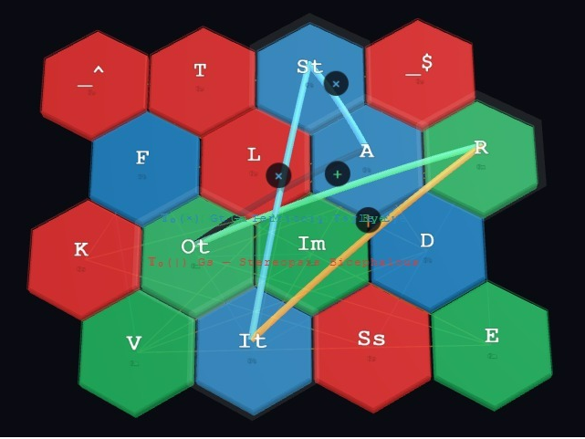
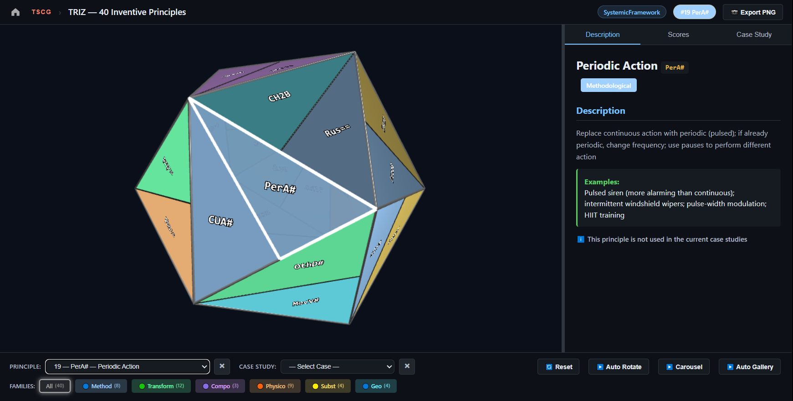
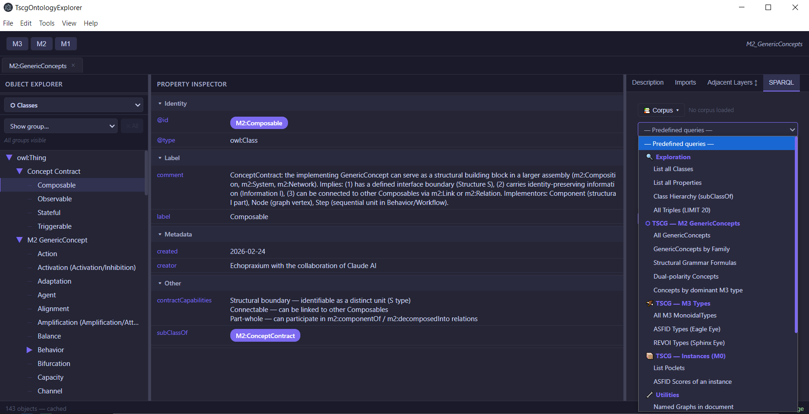
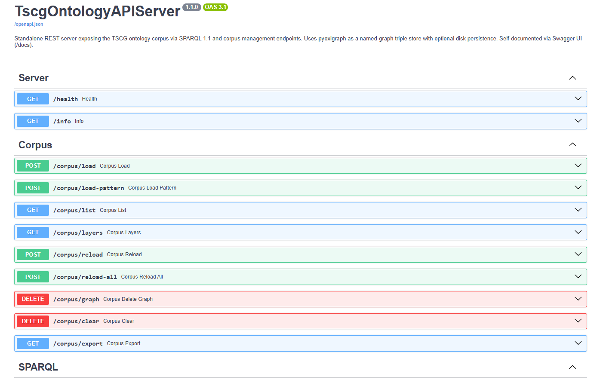
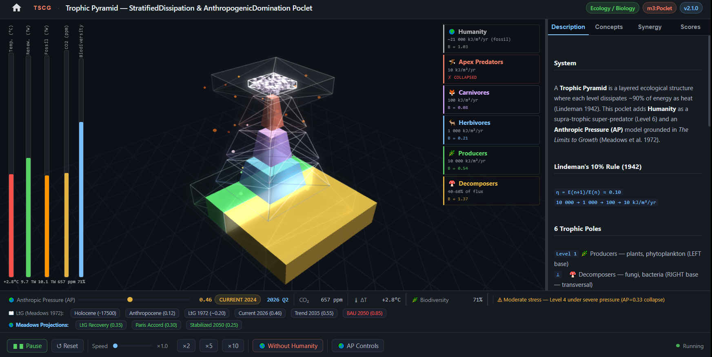
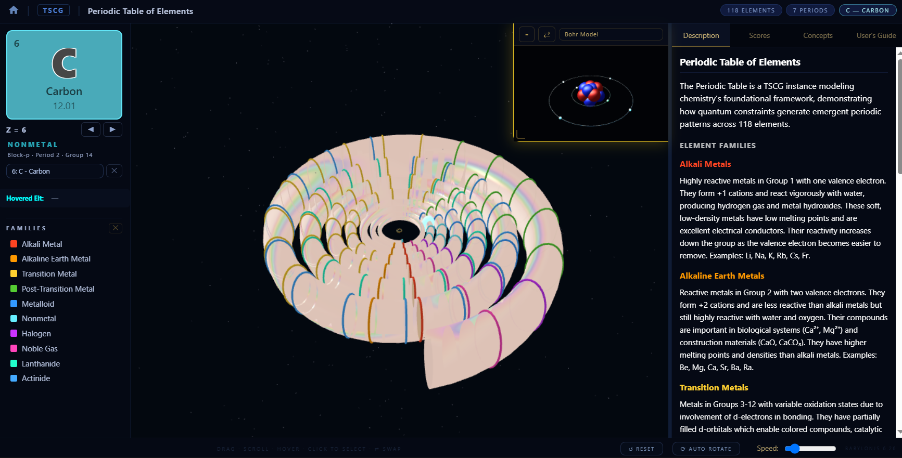

# TSCG: Transdisciplinary System Construction Game
## A Systemic Modeling Toolkit

**Authors**: Michel Kern (aka Echopraxium) with the collaboration of Claude AI
**Date**: June 2026
**Version**: 6.0
**Smart Prompt Version**: TSCG v16.2.0 (June 2026)
**DOI (this version, v6.0)**: 10.5281/zenodo.21001944
**DOI (all versions)**: 10.5281/zenodo.18471859
**DOI (Prior Work, v5.0)**: 10.5281/zenodo.19544443
**Repository**: https://github.com/Echopraxium/tscg
**Live Demo**: https://echopraxium.github.io/tscg/
**License**: CC BY 4.0 (document) — BSD 3-Clause Clear (source code)

---

---

## Abstract

TSCG is an **exploratory modeling toolkit** for complex systems, arising from more than
twenty-five years of personal intuition about recurrent transdisciplinary invariants.
Rather than a validated theory, it is an **open invitation** — an arbitrary but
operational modeling grid built around a **bicephalous architecture** combining two
complementary perspectives: **ASFID** (Attractor, Structure, Flow, Information,
Dynamics) for Territory measurement, and **REVOI** (Representability, Evolvability,
Verifiability, Observability, Interoperability) for Map construction. A third grammar,
**TKSL** (Temporality, Knowledge, Symbol, Localizability), formalizes their stereopsic
fusion — the epistemic depth produced by triangulating the two perspectives.

The mathematical foundation is **Structural Grammar** based on Lambek calculus and
free commutative monoidal categories. The monoidal product operators (`×`, `+`, `|`)
capture the simultaneous, non-separable co-presence of dimensions — without requiring
a metric space or Hilbert structure — placing TSCG on a rigorous algebraic footing,
pending expert review.

The toolkit adopts a **falsificationist stance**: it has not yet been invalidated by a
corpus of **33 validated instances** — the primary empirical instrument of TSCG.
Historically, the first instance type to emerge was the **Poclet** (25 validated): a
minimal, pedagogical model of a single system, spanning photography, Norse mythology,
nuclear engineering, biology, electronics, music theory, blockchain consensus, plate
tectonics, and the periodic table. The corpus subsequently extended to three additional
instance types: **SystemicFrameworks** (VSM, TRIZ, Business Model Canvas),
**SymbolicSystemGrammars** (I-Ching, TriskeleToolchain), and **TscgTools** —
software instruments operating reflexively on the toolkit itself.

Epistemic alignment is measured by two complementary metrics. The **epistemic gap δ₁**
(`|ASFID_mean − REVOI_mean| / √2`) quantifies the distance between Territory
measurement and Map construction, classified into four SpectralClasses (Coherent,
OnCriticalLine, Liminal, Enigmatic). The **Epistemic Focal Score (EFS / δ₂)**
(`stereopsicDepth × (1 − |focalBias|)`) measures the quality of stereopsic fusion
when Gs/TKSL primitives are mobilized, classified into six FocalClasses from
Emmetropic to Astigmatic.

Twelve Poclets are accompanied by standalone HTML simulations (BabylonJS 3D or
p5.js Canvas2D) forming the **TSCG Simulation Gallery**. The Business Model Canvas
SystemicFramework features the most advanced simulation: 12 real-world company
cases, 5 lifecycle phases, and 34 documented transitions.

TSCG is submitted to the research community not as a Theory of Everything, but as a
**community-revisable construction kit** — a work in active gestation, submitted not
imposed. It is an invitation to test whether this arbitrary grid can be broken, and
if not, what it enables us to see across disciplinary silos.

**Without close collaboration with Claude AI — including documentary research,
delegation of algebraic formalization, ontology encoding, and pair modeling for
candidate GenericConcepts — this project would not have been concretized.**

**Keywords**: Systems Modeling, Ontology Engineering, Transdisciplinarity, Knowledge
Representation, Map-Territory, Cybernetics, Structural Grammar, Monoidal Categories,
Semantic Web, Desiloification, Systemic Esperanto, Human-AI Collaboration

---

## 1. Introduction

### 1.1 The Problem of Disciplinary Silos and the "Desiloification" Hypothesis

Modern civilization confronts challenges — climate change, pandemic response,
artificial intelligence governance, sustainable energy transitions — that are
inherently systemic and transcend any single discipline. Yet our intellectual
infrastructure remains fragmented. The nuclear engineer designing reactor safety
systems, the photographer balancing the *Exposure Triangle*, the mythologist
interpreting the Norse cosmological tree *Yggdrasil*, the nephrologist modeling
the *RAAS* (Renin-Angiotensin-Aldosterone System), and the distributed systems
researcher analyzing Nakamoto consensus in Bitcoin all grapple with structurally
isomorphic challenges: maintaining equilibrium through balanced competing forces,
managing trade-offs, designing for stability under perturbation, resisting
entropy-driven degradation. Yet these practitioners have no shared language to
recognize their kinship.

This fragmentation generates three compounding problems. First, **redundant
reinvention**: *Negative feedback* (control theory), *Homeostasis* (biology),
*Equilibration* (economics), and *Mean reversion* (finance) describe the same
fundamental pattern, yet communities rarely cross-pollinate. Second, **integration
barriers**: insights from hormonal cascade regulation in physiology go unrecognized
as structural twins of neutron moderation in nuclear physics, or of proof-of-work
difficulty adjustment in blockchain consensus. Third, **ontological proliferation**:
without principled abstraction, knowledge systems explode with domain-specific
concepts, becoming cognitively intractable.

The central hypothesis of TSCG — the *desiloification hypothesis* — is this:
**most systems, whether natural or artificial, physical or abstract, share a set of
generic, recurring, transdisciplinary principles that can be identified, formalized,
and used as a shared vocabulary**. The project does not claim these principles are
exhaustive or that they constitute a complete description of reality. It claims only
that they are sufficiently common and structurally robust to serve as a practical
construction kit for systemic modeling.

A corollary hypothesis — which TSCG's growing instance corpus progressively
supports — is that the *same monoidal product formula* can describe structurally
homologous phenomena across entirely unrelated domains. Dissipation (`F × D`) governs
energy loss in thermodynamics, signal attenuation in electronics, and hash-rate decay
in a declining proof-of-work network alike. This cross-domain resonance is not
metaphor: it is the empirical claim that TSCG invites the research community to
scrutinize and challenge.

TSCG does not emerge from a void. Several prior frameworks have pursued structurally
related ambitions. Stafford Beer's **Viable System Model** (VSM, 1972) demonstrated
that the recursive structure of viable organizations could be described by a small set
of cybernetic functions, independent of domain. Genrich Altshuller's **TRIZ**
(1946–1985) distilled forty inventive principles from hundreds of thousands of patents,
revealing that inventive solutions recur across engineering domains — a strikingly
early empirical validation of the desiloification hypothesis. Alfred Korzybski's
**map-territory distinction** (1933) provides TSCG's epistemological backbone,
extended here into a formalized bidirectional feedback loop between representation
and phenomenon. More broadly, TSCG inherits from **General System Theory**
(von Bertalanffy, 1968), **Cybernetics** (Wiener, 1948), **Category Theory**
(Eilenberg & Mac Lane, 1945), and **Semantic Web** ontology engineering
(Berners-Lee et al., 2001).

Where TSCG differs from these precedents is in its *combinatorial* approach: rather
than proposing a fixed set of domain-specific patterns or a single organizational
archetype, TSCG constructs a vocabulary of atomic transdisciplinary concepts —
**GenericConcepts** — that combine through monoidal products to generate
domain-specific patterns on demand. The toolkit is deliberately open-ended and
self-revising: a construction kit, not a finished cathedral.

This aspiration has a linguistic precedent. In 1887, Ludwig Lazarus Zamenhof proposed
**Esperanto** as a constructed common language designed to transcend national barriers
— not by replacing any natural language, but by offering a neutral shared medium.
TSCG pursues an analogous ambition at the level of systemic knowledge: a **Systemic
Esperanto**, a constructed common vocabulary for describing the structural behavior of
systems across disciplines. The goal is not *desiloification by erasure* but
*desiloification by translation* — providing a shared layer of abstraction through
which practitioners from biology, engineering, economics, mythology, and blockchain
research can recognize structural kinship without abandoning their own domain
vocabulary.

TSCG makes no claim to be a new Theory of Everything. Its 80 GenericConcepts do not
exhaust the structure of reality; its monoidal formulas are not laws of nature. The
vocabulary offered here involves deliberate, partially arbitrary choices — submitted,
not imposed.

---

### 1.2 Origin: Twenty-Five Years of Intuition, Then AI-Assisted Concretization

This toolkit did not emerge from an academic program. It grew from more than
**twenty-five years** of informal, persistent reflection — what the author describes
as "creative meditation" — on whether generic principles truly recur across most
systems. What spanned those years was not the ASFID/REVOI dimensions themselves, but
the underlying intuition: the hypothesis that transdisciplinary structural invariants
exist and can be named.

The concretization of this intuition is recent (approximately 5–6 months of active
development as of June 2026). It began with approximately twenty exploratory
conversations with DeepSeek, during which the ASFID dimensions first emerged in
recognizable form. This was followed by sustained collaboration with Claude AI
(Anthropic), which became the primary and lasting partner for all subsequent work:
deepening the framework, formalizing the M3 foundation, developing the ontology
layers, and growing the instance corpus.

The decisive infrastructure step came with Claude's **Projects** feature, which
maintains a persistent corpus of reference documents across sessions — including the
**Smart Prompt**, a structured document summarizing all key architectural decisions,
naming conventions, and project state. This enabled systematic formalization,
publication on GitHub, and iterative development of the instance corpus.

#### Delegated tasks (Claude AI as executor)

**Algebraic formalization.** The monoidal product formulas characterizing each
GenericConcept, and the Structural Grammar foundation (Lambek calculus, free
commutative monoidal categories) were formulated by Claude AI on the basis of the
author's conceptual specifications. These formulations are acknowledged as
*AI-assisted approximations* pending rigorous mathematical review.

**Documentary research per instance.** For each instance under development, Claude AI
conducted targeted literature research — sourcing domain-specific descriptions,
identifying key structural components, and synthesizing cross-disciplinary analogies.

**JSON-LD ontology encoding.** Translation of conceptual models into well-formed
JSON-LD files — respecting W3C standards, TSCG namespace conventions, and ontological
consistency constraints — was delegated to Claude AI. The author reviewed and
validated each generated file.

#### Collaborative tasks (Claude AI as active partner)

**GenericConcept identification and modeling.** The identification of candidate
GenericConcepts — particularly during instance analysis, when a new system reveals
structural patterns not yet captured in M2 — is a genuinely collaborative process.
The author proposes candidates based on systemic intuition; Claude AI evaluates
monoidal decomposition, checks consistency with existing M2 concepts, and proposes
formulations.

**Instance simulation generation.** Each standalone HTML simulation is generated
collaboratively. Claude AI takes initiative on illustrative mechanisms; the author
steers ergonomics and pedagogical credibility through iterative feedback.

**Workflow engineering via Skills pipelines.** Two structured AI *Skills* — reusable
pipeline specifications encoding the author's accumulated methodology — have been
formalized: an **Instance Analysis Pipeline** (proposal → analysis → modeling →
simulation) and a **Research Article Pipeline** (audit → planning → drafting →
revision → finalization).

#### Continuity infrastructure

The collaboration is sustained across sessions by two complementary mechanisms. The
**Smart Prompt** re-injects architectural state at the start of each new session.
The **Skills** pipeline system encodes procedural knowledge — not what the toolkit
is, but how to work with it — as reusable, versioned AI instructions.

---

### 1.3 The Bicephalous Architecture: Stereoscopic Knowledge

To understand TSCG's architecture, consider a creature from Mesopotamian mythology:
**Anzû**, a divine entity depicted as a lion-headed eagle — simultaneously earthly
and celestial, interpretive and calculative. In TSCG, Anzû serves as the foundational
metaphor for the M3 layer: a single toolkit with two heads, each possessing one eye.

The critical detail is the *one eye per head*. In optics, a single eye produces
**monocular vision**: a flat, two-dimensional projection with no depth perception.
Two eyes, positioned at a slight angle to each other, produce **binocular vision**:
the brain triangulates the two slightly different images into a three-dimensional
depth map. The same principle governs epistemic architecture.

**The Eagle Head** scrutinizes the world as it *is* — measuring, instrumenting,
quantifying phenomena. Its eye, the **Eagle Eye**, operates through the five ASFID
dimensions: Attractor, Structure, Flow, Information, Dynamics. It asks of any system:
what draws it toward equilibrium? what organizes it? what flows through it? what
information governs it? what dynamics evolve it? The Eagle Eye produces a **Territory score profile** — a quantified description of the system's observable behavior across the five ASFID dimensions.

**The Sphinx Head** contemplates the world as it is *represented* — modeling,
theorizing, interpreting. Its eye, the **Sphinx Eye**, operates through the five REVOI
dimensions: Representability, Evolvability, Verifiability, Observability,
Interoperability. It asks of any model: can this system be adequately represented?
can the model evolve as the system does? can its predictions be verified? can its
behavior be observed? can it communicate with other models? The Sphinx Eye produces a **Map score profile** — a quantified assessment of the model's epistemic quality across the five REVOI dimensions.

Neither head can function alone. The Eagle Head without the Sphinx Head produces raw
measurements with no interpretive framework — data without meaning. The Sphinx Head
without the Eagle Head produces elegant theories with no empirical grounding — meaning
without data. Each head, alone, has monocular vision: a flat, depthless perspective.
Together, they produce **stereoscopic epistemic depth**: the ability to perceive not
only the system, but the *distance* between our model of it and the reality it
represents.

This distance is formalized as the **epistemic gap δ₁**:

```
δ₁ = |ASFID_mean − REVOI_mean| / √2
```

A small δ₁ indicates that the model adequately tracks the system (SpectralClass:
Coherent); a large δ₁ signals either model inadequacy or an under-observed Territory
(SpectralClass: Enigmatic).

But two-eyed stereopsis, however powerful, still has limits: it measures *distance*
between Map and Territory, but not the *quality of their fusion*. This is where the
third grammar enters.

**The Stereopsic Grammar (Gs / TKSL)** is TSCG's most recent architectural addition.
Where the Eagle Eye (Gt) and the Sphinx Eye (Gm) each operate within their own
monoidal grammar, Gs formalizes the act of *triangulation itself* — the stereopsic
focal point where Territory and Map converge into actionable knowledge. Its four
nominal primitives are: **T** (Temporality — *when?*), **K** (Knowledge — *what?*),
**Ss** (Symbol — *what sign?*), and **L** (Localizability — *where does it
converge?*). Two polar modifiers — `_^` (PositivePole, onset/amplifying) and
`_$` (NegativePole, terminus/attenuating) — are not primitives but modifiers
governing polarity within Gs expressions.

The quality of stereopsic fusion is measured by the **Epistemic Focal Score (EFS / δ₂)**:

```
δ₂ = stereopsicDepth × (1 − |focalBias|)
```

where `stereopsicDepth` reflects the proportion of active TKSL primitives mobilized
by the instance, and `focalBias` (`REVOI_mean − ASFID_mean`) indicates whether the
model leans toward Map abstraction (Hyperopic) or Territory detail (Myopic). A
balanced, deep stereopsis yields a high δ₂ (FocalClass: Emmetropic); a collapsed
fusion yields a low δ₂ (FocalClass: Astigmatic).

Together, the three grammars — Gt (Eagle Eye / Territory), Gm (Sphinx Eye / Map),
Gs (Stereopsic fusion) — constitute the **Base16**: 16 primitives in total (13 typed
+ 3 neutral operators), forming the complete generative vocabulary of the TSCG M3
foundation.

*Figure 1 (below) shows the Base16 hexagonal monoidal grid. The connecting lines illustrate how **m2:Coherence** simultaneously mobilizes primitives from all three grammars: Territory (A, St, It), Map (R, O), and Stereopsis (polar modifiers).*

<div style="text-align:center"></div>

*Figure 1 — Base16 hexagonal monoidal grid. Red = Gt/ASFID (A, S, F, It, D). Green = Gm/REVOI (R, E, V, O, Im). Blue = Gs/TKSL (T, _^, _$, K, Ss, L). The connecting lines illustrate m2:Coherence spanning all three grammars — dark circles mark the monoidal fusion points.*

---

## 2. The TSCG Architecture

TSCG is organized as a **four-layer hierarchical ontology**, implemented in JSON-LD
following W3C semantic web standards. The layers are ordered from the most abstract
(M3) to the most concrete (M0), connected by three functors that progressively
instantiate and specialize the toolkit's vocabulary:

```
M3 GenesisGrammar      — Mathematical foundation (3 monoidal grammars, Base16)
  │ F_grammaticalization ↓
M2 GenericConcepts     — 80 atomic transdisciplinary patterns (9 families)
  │ F_instantiation ↓
M1 Domain Extensions   — Knowledge-field vocabularies (Biology, Chemistry, Music…)
  │ F_concretize ↓
M0 Instances           — Validated models of concrete systems (33 instances)
```

Each layer is a strict refinement of the one above: M2 concepts are monoidal
products of M3 primitives; M1 concepts are instantiations of M2 concepts in
specific domains; M0 instances are concrete realizations of M1 concepts in specific
systems. No layer introduces vocabulary that belongs to a higher layer — a discipline
enforced by the **M2 Purity Principle** (§2.8).

---

### 2.1 M3 — The GenesisGrammar: Three Monoidal Grammars

The foundation of TSCG is the **GenesisGrammar** (`M3_GenesisGrammar.jsonld`): a
set of three free commutative monoidal grammars whose primitives jointly constitute
the complete generative vocabulary of the toolkit. This foundation — established in
v16.x through the **Structural Grammar** migration — is grounded in Lambek calculus
and category theory (Mac Lane, 1971).

Each grammar has its own operator, its own neutral element, and its own set of
typed primitives. The operator alone identifies the grammar: no prefix is needed.
Operator priority follows arithmetic convention: `×` binds tighter than `+`, which
binds tighter than `|`. Thus `A × S + R | K` reads as `((A × S) + R) | K`.

<table>
<tr><th>Grammar</th><th>Operator</th><th>Neutral element</th><th>Acronym</th><th>Primitives</th><th>Count</th></tr>
<tr><td>**Gt** (Territory)</td><td><code>×</code></td><td>EmptyTerritory</td><td><strong>ASFID</strong></td><td>A, S, F, It, D</td><td>5</td></tr>
<tr><td>**Gm** (Map)</td><td><code>+</code></td><td>EmptyMap</td><td><strong>REVOI</strong></td><td>R, E, V, O, Im</td><td>5</td></tr>
<tr><td>**Gs** (Stereopsis)</td><td><code>|</code></td><td>EmptyStereopsis</td><td><strong>TKSL</strong></td><td>T, _^, _$, K, Ss, L</td><td>6</td></tr>
</table>

**Total: Base16 — 16 typed primitives**: A, S, F, It, D (Gt) + R, E, V, O, Im (Gm) + T, K, Ss, L, _^, _$ (Gs). The three operators (×, +, |) identify the grammar but are not counted as primitives.

A GenericConcept such as Homeostasis is written `A × St × F | L` — a monoidal
expression whose meaning emerges from the simultaneous, non-separable co-presence
of its primitives. This requires no metric, no inner product, and no notion of
orthogonality — only the algebraic structure of a free commutative monoidal category.

---

### 2.2 Gt — The Eagle Eye (Territory / ASFID)

The Territory grammar **Gt** measures systems as they empirically exist. Its five
primitives decompose any system along independent dimensions:

| Primitive | Name | Operational question |
|-----------|------|---------------------|
| **A** | Attractor | What draws the system toward equilibrium or stable states? |
| **S** | Structure | What stable organizational pattern governs its components? |
| **F** | Flow | What transfers energy, matter, or information through it? |
| **It** | Information | What signals, codes, or cybernetic loops govern its behavior? |
| **D** | Dynamics | How does it evolve temporally through state transitions? |

Each primitive is scored on [0, 1] during instance analysis, producing the
**ASFID score profile** that quantifies the Territory footprint of the system.

⚠️ **It** (Information, Territory) is systematically distinguished from **Im**
(Interoperability, Map) in all formulas and score properties (`m0:scoreIt` vs
`m0:scoreIm`).

---

### 2.3 Gm — The Sphinx Eye (Map / REVOI)

The Map grammar **Gm** evaluates models as epistemic constructs. Its five primitives
assess the quality of any representation of a system:

| Primitive | Name | Operational question |
|-----------|------|---------------------|
| **R** | Representability | Can this system be adequately encoded in a formal model? |
| **E** | Evolvability | Can the model update as the system changes? |
| **V** | Verifiability | Can the model's predictions be empirically tested? |
| **O** | Observability | Can the system's relevant states be perceived and measured? |
| **Im** | Interoperability | Can this model integrate with and translate to other models? |

REVOI scores are inherently **observer-relative**: the same system may receive
different REVOI scores from a biologist and an engineer. This relativity is a
feature, not a defect — the Map is always the map of *someone*.

---

### 2.4 Gs — The Stereopsic Grammar (TKSL)

The Stereopsic grammar **Gs** is TSCG's most architecturally distinctive layer.
Where Gt measures the Territory and Gm constructs the Map, **Gs formalizes the act
of triangulation itself** — the focal convergence where Territory observation and
Map construction produce actionable, situated knowledge.

Gs operates with the `|` operator (stereopsic fusion):

| Element | Type | Name | Question | Theoretical basis |
|---------|------|------|----------|-------------------|
| **T** | Primitive | Temporality | *When?* | Temporal interface Gt↔Gm |
| **K** | Primitive | Knowledge | *What?* | Maturana/Varela cognition |
| **Ss** | Primitive | Symbol | *What sign?* | Peirce, Saussure |
| **L** | Primitive | Localizability | *Where does it converge?* | Wiener, Ashby |
| `_^` | Modifier | PositivePole | *(onset/amplifying)* | Polarity modifier |
| `_$` | Modifier | NegativePole | *(terminus/attenuating)* | Polarity modifier |

Two special derived elements:

- **Pole Annihilation Axiom**: `_^ | _$ = StereopsisEmptySet` — named constant
  `#Null`. When positive and negative poles cancel, stereopsic fusion collapses.
- **TriadicBalance**: `_0 = _^ | _$` — the central equilibrium state of Gs,
  a DerivedGsElement preserving Base16 integrity.

**Notation for hybrid formulas**: when a formula spans multiple grammars, the
operator identifies the grammar unambiguously:

```
Pure Territory:   A × S × F
Pure Map:         R + E + V
Hybrid:           A × St × It × D | K
                  ^^^^^^^^^^^^^^^^   ^
                  Gt primitives      Gs primitive
```

In hybrid formulas, Territory and Map primitives carry their monoid index (St, It)
to avoid collision with Gs primitives sharing similar names.

*See Figure 1 (§1.3) for the Base16 hexagonal monoidal grid illustration.*

---

### 2.5 M2 — GenericConcepts: The Transdisciplinary Vocabulary

M2 hosts **80 atomic GenericConcepts** organized into 9 families. Each GenericConcept
carries a monoidal formula encoding its structural signature as a product of M3
primitives. Full catalog in Appendix C; architecture detailed in §3.

---

### 2.6 M1 — Domain Extensions

M1 instantiates M2 concepts within specific knowledge fields. Thirteen active
extensions cover Biology, Chemistry, Physics, Electronics, Economics, Photography,
Music, Mythology, Optics, SystemicModeling, Education, Geology, and
BusinessModeling. Each M1 extension defines **KnowledgeFieldConceptCombos** —
domain-specific combinations of GenericConcepts validated within a single knowledge
field. M1 is also governed by its own SHACL grammar (`M1_Schema.shacl.ttl`), enforcing
structural consistency across all domain extensions.

---

### 2.7 M0 — Instances

M0 is the empirical layer: **33 validated instances** implementing M1/M2 concepts
against concrete systems. The instance types and their counts are detailed in §4.

---

### 2.8 The Purity Principle

A discipline enforced at every layer: **no concept belongs to a layer lower than
its degree of generality warrants**. A concept earns M2 membership only by
demonstrating structural relevance across at least six unrelated domains (the
six-domain threshold, §6.2). Domain-specific concepts belong in M1; concrete
system models belong in M0.

The anti-pattern — **Ontological Overfitting** — occurs when a concept is added
to M2 because it appears in one well-studied system, creating a spurious 1:1
map-territory correspondence. TSCG actively resists this pressure, documented in
`OntologicalOverfitting.md`.

---

## 3. The GenericConcepts Layer (M2)

### 3.1 Structural Grammar as a Concept Construction Language

M2 GenericConcepts are not defined by verbal description alone — each carries a
**monoidal formula** encoding its structural signature as a product of M3 primitives.
The formula is written using the operators of the relevant grammar(s): `×` for
Territory (Gt), `+` for Map (Gm), `|` for Stereopsis (Gs), with priority
`×` > `+` > `|`.

The formula captures the idea that a GenericConcept requires the *simultaneous,
non-separable co-presence* of its primitives. Homeostasis (`A × St × F | L`)
cannot be reduced to Attractor alone, nor to Structure alone — it emerges only from
their joint activation. This is not a metaphor: it is a structural claim, expressed
in the language of free commutative monoidal categories (Lambek calculus), that
the concept is irreducible to any proper subset of its primitives.

Four morphism types relate GenericConcepts to each other:

- **Inclusion ↪**: Homeostasis ↪ Regulation (specialization)
- **Composition ∘**: Learning = Memory ∘ Adaptation
- **Duality ^op**: Convergence^op = Divergence; Entropy^op = Negentropy
- **Emergence ⇒**: M_A × M_B ⇒ M_C (GenericConceptCombo)

---

### 3.2 The Nine Families

GenericConcepts are organized into nine families reflecting their dominant structural
role. The complete listing with monoidal formulas is in Appendix C; here we present
each family with representative examples.

**Structural** (23 concepts): Patterns governing the stable organization of components.
*Examples*: Network (`S × I × F | O + R + Im + V`), Hierarchy (`S × A`),
Coherence (`A × St × It | R + O | _^/_$`).

**Dynamic** (17 concepts): Patterns governing temporal transformation and process.
*Examples*: Process (`D × F`), Bifurcation (`D × F | L`),
Modelisation (`D × F × It | R + V + E`), TriadicBalance (`A × F × D | _0`).

**Ontological** (10 concepts): Patterns governing systemic environment and framing.
*Examples*: Context (`O + R + Im + E`), Observer (`I × A`), State (`I`).

**Regulatory** (10 concepts): Patterns governing stability and control.
*Examples*: Homeostasis (`A × St × F | L`), Regulation (`A × S × F | R + V + E`),
Threshold (`A × I`).

**Informational** (8 concepts): Patterns governing encoding, signaling, and
representation. *Examples*: Signal (`I × F`), Code (`It × Ss`),
Language (`Ss × F | K`).

**Adaptive** (4 concepts): Patterns governing learning and resilience.
*Examples*: Adaptation (`I × F × D`), Memory (`∫(D−F)dτ`), Resilience (`A × S`).

**Energetic** (4 concepts): Patterns governing energy transformation and dissipation.
*Examples*: Dissipation (`F × D`), Entropy (`F × It × D | _^/_$`),
Transducer (`F × S × I`).

**Relational** (5 concepts): Patterns governing connections and interactions.
*Examples*: Mediator (`F × It | K`), Agent (`St × It × D | K`), Role (`Ss | K`).

**Teleonomic** (1 concept): Self-Organization (`A × I × D`), Emergence (`It × S × D | _0 | L`).

---

### 3.3 Bicephalous GenericConcepts

A subset of GenericConcepts span *both* Gt and Gm grammars in a single formula.
These **bicephalous GenericConcepts** capture phenomena that are simultaneously
territorial (observable) and cartographic (representational) by nature.

The most architecturally significant example is **Coherence**
(`A × St × It | R + O | _^/_$`):

- `A` → alignment toward a common attractor (Territory / Eagle Eye)
- `St` → globally continuous structure (Territory / Eagle Eye)
- `It` → shared / compatible information (Territory / Eagle Eye)
- `R` → Representability — coherence as modeled (Map / Sphinx Eye)
- `O` → Observability — coherence as perceived (Map / Sphinx Eye)

Note the St/It indexation: in this hybrid formula, Territory primitives S and I
carry their monoid index (St, It) to avoid ambiguity with Map or Gs primitives.

Coherence admits four regimes (quaternary polarity):

|  | R + O strong | R + O weak |
|--|-------------|------------|
| **A × St × It strong** | Verified truth | Misunderstood reality |
| **A × St × It weak** | Illusion / ideology | Total chaos |

Two v16.2.0 additions are notably bicephalous or cross-grammar:

- **Modelisation** (`D × F × It | R + V + E`): the act of constructing a formal
  representation — simultaneously a structural operation (Gt) and an epistemic
  assessment (Gm). Transdisciplinary across scientific modeling, cartography,
  software architecture, legal codification, musical notation, and linguistics.

- **TriadicBalance** (`A × F × D | _0`): equilibrium achieved through the
  triangulation of three perspectives. The `_0` (EquilibriumPole) is the qualitative
  optimum — not an arithmetic midpoint — toward which the system is attracted.

---

### 3.4 M2 Population Control: Three Instruments

M2 vocabulary growth is governed by three complementary instruments — each operating
at a different level of generality, in the spirit of **LEGO Technic modularity**:
atomic bricks that combine into assemblies that combine into systems.

**Dual-polarity pairs** — 11 GenericConcepts are defined as paired opposites whose
formula takes two forms via `_^` (onset) and `_$` (terminus) poles: Coherence/
Incoherence, Entropy/Negentropy, Convergence/Divergence, Potentialization/F-Depletion,
and seven others. This avoids proliferating separate M2 concepts for phenomena that
are structurally identical but directionally opposed.

**GenericConceptCombos** — synergistic combinations of two or more existing
GenericConcepts that produce emergent patterns not reducible to their components.
Defined in `M1_CoreConcepts.jsonld` as reusable bricks across all domains. Four
validated Combos: Inertia ⇒(Memory, Entropy), Potentialization ⇒(Activation, Process),
AbsorbingState ⇒(Stase, Entropy), TopologicalDefect ⇒(Incoherence, Invariant).

**KnowledgeFieldConceptCombos (KFCCs)** — domain-specific assemblies of
GenericConcepts, defined in M1 domain extensions (Biology, Economics, Music, etc.).
KFCCs capture patterns that are transdisciplinary within a knowledge field but not
across all fields — they belong in M1, not M2. They are the LEGO assemblies built
from M2 atomic bricks, reusable within their domain.

Together, these three instruments allow M2 to remain **compact and non-redundant**
while the M1 layer absorbs domain-specific complexity. The M2 Purity Principle
(§2.8) and the six-domain threshold (§6.2) enforce the boundary between the two layers.

---

### 3.5 GenericConceptCombos (detail)

### 3.6 The Causal Chain for Irreversibility

Beyond atomic GenericConcepts, M2 defines the **GenericConceptCombo** class for
synergistic combinations producing emergent patterns not reducible to their
components. Instances of GenericConceptCombo are defined in M1_CoreConcepts.jsonld.
TSCG v16.2.0 defines four validated Combos:

| Combo | Formula | Components | Polarity |
|-------|---------|------------|----------|
| **Inertia** | `S × F × I × D` | ⇒(Memory, Entropy) | Neutral |
| **Potentialization** | `A × D × F | _^/_$` | ⇒(Activation, Process) | Dual |
| **Absorbing State** | `S × A × F × I × D` | ⇒(Stase, Entropy) | Neutral |
| **Topological Defect** | `St × A × It | R + O` | ⇒(Incoherence, Invariant) | Neutral |

**Potentialization** resolves a long-standing tension: concepts like Resource,
Storage, Hub, and Stateful — previously problematic because they implied F=0 —
are now understood as systems in suspended Potentialization (F_potential mode).

**Absorbing State** is a Stase sealed irreversibly by Entropy production — a
terminal state from which Potentialization is structurally impossible, in contrast
to ordinary Stase (`S × A`) which remains reversible by construction (D absent).

---

### 3.6 The Causal Chain for Irreversibility

The analysis of the NakamotoConsensus instance produced the most significant single
M2 expansion in the toolkit's history: five new atomic GenericConcepts and a
foundational M3 amendment (Flow axiom relaxation: F ≥ 0).

The five additions:

| Concept | Formula | Family | Key insight |
|---------|---------|--------|-------------|
| **Processor** | `S × I × F × D` | Dynamic | Generic transformer |
| **Transducer** | `F × S × I` | Energetic | Converts flux type; subClassOf Processor |
| **Entropy** | `F × It × D | _^/_$` | Energetic | Irreversibility measure |
| **Stase** | `S × A` | Structural | F=0 reversible ground state |
| **Coherence** | `A × St × It | R + O | _^/_$` | Structural | Bicephalous |

Together these constitute a **causal chain for irreversibility**:

```
F_active (available exergy)
  │
  ↓ Dissipation (F × D) — equations time-reversible (Feynman)
  │
F_degraded ──→ Entropy (F × It × D | _^/_$) ← irreversibility emerges here
  │
  ↓ Memory (∫dτ)
  │
Inertia ⇒(Memory, Entropy)
  │
  ↓ maximal → seals Stase
  │
Absorbing State ⇒(Stase, Entropy)
```

The Energetic hierarchy is now:
```
Processor (S × I × F × D)
  └── Transducer (F × S × I)    subClassOf Processor
        └── Dissipation (F × D)  subClassOf Transducer
              └── produces → Entropy (F × It × D | _^/_$)
```

---

### 3.7 M2 Purity and the Six-Domain Threshold

A candidate GenericConcept earns M2 membership only by demonstrating structural
relevance across **at least six unrelated knowledge fields**. This threshold
guards against Ontological Overfitting — the anti-pattern of adding a concept
to M2 because it appears prominently in one well-studied system.

The NakamotoConsensus instance provided the sixth-domain validation for Dissipation
and Entropy: confirming their M2 status by demonstrating structural relevance in
distributed consensus alongside thermodynamics, biology, electronics, photography,
and mechanical engineering.

---

### 3.8 Mathematical Validation Status

The monoidal formulas in this section were developed collaboratively with Claude AI
and carry the ontology's own assessment: *preliminary, AI-assisted, pending expert
review*. The planned path toward formal validation is SHACL encoding — expressing
monoidal product constraints as machine-verifiable SHACL shapes — identified as a
priority for a future release.

The Structural Grammar foundation (Lambek calculus, free commutative monoidal
categories) provides a more rigorous algebraic basis than the earlier Hilbert-space
approximation. Nevertheless, the claim that TSCG's `×` operator satisfies all
axioms of a free commutative monoidal category in the strict mathematical sense
remains to be verified by a domain expert.

---

## 4. The Instance Corpus

### 4.1 Instances as the Empirical Backbone of TSCG

The primary empirical instrument of TSCG is the **instance** — a validated model
of a concrete system encoded as a JSON-LD ontology file (`M0_*.jsonld`), structured
according to the TSCG four-layer architecture and constrained by a SHACL grammar
(`M0_Instances_Schema.shacl.ttl`).

An instance is not a simulation, nor a description. It is a **formal claim**: that
a given system's structure can be adequately characterized by a combination of
GenericConcepts drawn from M2, instantiated through M1 domain extensions, and
scored against the ASFID/REVOI dimensions. Each instance is falsifiable: a
well-formed counter-argument (demonstrating that a key GenericConcept is absent,
or that a score is systematically miscalibrated) constitutes a valid challenge to
the instance's modeling claims.

Historically, the first instance type to emerge was the **Poclet** — a minimal,
self-contained model of a single system, designed for pedagogical clarity and
structural transparency. The corpus subsequently extended to three additional
instance types as the toolkit matured:

```
Poclet               — Minimal model of a single concrete system
SystemicFramework    — Re-encoding of an existing formal framework in TSCG
SymbolicSystemGrammar — Encoding of a symbolic/generative system
TscgTool             — Software instrument operating reflexively on the toolkit
```

All four types share the same JSON-LD structure, SHACL constraints, and scoring
conventions. They differ in their **ontological role** (`m3:ontologyType`) and in
the nature of the system being modeled.

As of v16.2.0, the corpus contains **33 validated instances** across all four types.

---

### 4.2 Poclets (25 validated)

A Poclet (from *pocket* + *let*) is the foundational instance type: a minimal,
self-contained TSCG model of a single system. The name reflects the design
philosophy — small enough to fit in a pocket, complete enough to stand alone.

Poclets span twelve knowledge domains, demonstrating the transdisciplinary reach
of the GenericConcept vocabulary:

| Domain | Poclet | Key GenericConcepts |
|--------|--------|---------------------|
| **Biology** | AdaptativeImmuneResponse | Homeostasis, Memory, Threshold |
| **Biology** | BloodPressureControl | Regulation, Homeostasis, Feedback |
| **Biology** | ButterflyMetamorphosis | Process, Transformation, Threshold |
| **Biology** | CellSignalingModes | Signal, Code, Transducer |
| **Biology** | ComplexChemicalSynapse | Signal, Threshold, Transducer |
| **Biology** | Kidneys | Homeostasis, Filter, Gradient |
| **Biology** | Raas | Regulation, Cascade, Homeostasis |
| **Biology** | TrophicPyramid | Hierarchy, Flow, Dissipation |
| **Chemistry** | PhaseTransition | Bifurcation, Threshold, Stase |
| **Distributed Systems** | NakamotoConsensus | Coherence, Entropy, Dissipation |
| **Economics** | KindlebergerMinsky | Bifurcation, Cycle, Attractor |
| **Electronics** | Transistor | Threshold, Transducer, Switch |
| **Electronics** | Vco | Regulation, Oscillation, Signal |
| **Energy** | FourStrokeEngine | Cycle, Dissipation, Transducer |
| **Energy** | FireTriangle | Threshold, Flow, Activation |
| **Gaming** | MtgColorWheel | Symmetry, Constraint, Network |
| **Geology** | PlateTectonics | Flow, Gradient, Bifurcation |
| **Music** | Counterpoint | Constraint, Regulation, Pattern |
| **Norse Mythology** | Yggdrasil | Network, Hierarchy, Axis Mundi |
| **Nuclear Engineering** | NuclearReactorsTypology | Regulation, Threshold, Transducer |
| **Optics / Color** | ColorSynthesis *(fédérateur)* | Symmetry, Constraint, Convergence |
| **Pedagogy** | Tpack | Network, Modularity, Intersection |
| **Photography** | ExposureTriangle | Regulation, Constraint, Gradient |
| **Physics** | Ptoe | Hierarchy, Symmetry, Invariant |
| **Signal Processing** | TvTestPattern | Code, Signal, Pattern |

*Note: ColorSynthesis is a federated Poclet aggregating sub-ontologies
(e.g., M0_RGB_Additive.jsonld, M0_CMY_Subtractive.jsonld).*

---

### 4.3 SystemicFrameworks (3 validated)

A **SystemicFramework** re-encodes an existing formal framework — already possessing
its own internal structure and vocabulary — through the TSCG lens.

**VSM — Viable System Model** (Beer, 1972): The recursive cybernetic model of viable
organizations is re-encoded as a five-level Regulation/Homeostasis hierarchy, with
System 3★ (algedonic channel) modeled as a Threshold-triggered Signal.

**TRIZ — Theory of Inventive Problem Solving** (Altshuller, 1946–1985): The 40
inventive principles and contradiction matrix are re-encoded as a combinatorial
Constraint × Transformation space, with the Ideal Final Result modeled as an
Attractor.

<div style="text-align:center"></div>

*Figure 2 — The TRIZ SystemicFramework BabylonJS 3D simulation. The 40 inventive
principles are distributed across the faces of a polyhedron, color-coded by family
(Method, Transform, Composition, Physics, Substance, Geometry). The interactive
interface allows navigation by principle, family, and case study, exposing the
structural topology of the TRIZ contradiction space as a TSCG Constraint ×
Transformation manifold.*

**BMC — Business Model Canvas** (Osterwalder, 2004): The nine BMC blocks are
re-encoded across ASFID dimensions. This SystemicFramework has the most advanced
simulation: 12 real-world company cases (Netflix, Nokia, Nintendo, Apple, Amazon,
Google, Microsoft, IBM, Kodak, Xerox, Michelin, Airbnb), 5 lifecycle phases, and
34 documented transitions, rendered as an interactive p5.js Canvas2D simulation.

*Note: BMC has two complementary ontology files. `M0_Bmc.jsonld` is the TSCG
instance model; `M0_BmcSimulation.jsonld` encodes the use-case data (12 companies,
34 transitions) that feeds the interactive simulation.*

---

### 4.4 SymbolicSystemGrammars (2 validated)

A **SymbolicSystemGrammar** encodes a symbolic or generative system whose primary
reality is semiotic rather than physical.

**I-Ching**: The 64 hexagrams are re-encoded as a binary combinatorial system
(`2^6 = 64` states) built from a Symmetry × Code × Cycle substrate. The I-Ching
constitutes a 3,000-year-old empirical proof of the desiloification hypothesis:
a culture-independent structural vocabulary for systemic states predating modern
systems theory by millennia.

**TriskeleToolchain**: A custom Rust toolchain (tsk-cc, tsk-link, triskele-vm,
tsk-asm) compiling C via LLVM IR to bytecode for a custom RISC virtual machine.
Its ISA (Instruction Set Architecture) comprises **256 opcodes organized into
exactly 16 categories** — one per M3 primitive, mapped bijectively to the Base16.
This constitutes an independent structural validation of the Base16 from a completely
unrelated domain: virtual machine design and compiler engineering (see §6.4).

---

### 4.5 TscgTools (3 validated)

**TscgTools** are software instruments that operate **reflexively** on the toolkit
itself — instances whose domain is TSCG's own infrastructure.

**TscgOntologyExplorer**: Desktop application (ElectronJS) for navigating the TSCG
ontology hierarchy.

<div style="text-align:center"></div>

*Figure 3 — The TscgOntologyExplorer desktop application (ElectronJS, v1.0). The
three-panel interface exposes M3/M2/M1 layer navigation (left: Object Explorer with
class hierarchy), property inspection (center: Property Inspector showing @id, @type,
label, creator, subClassOf), and SPARQL query execution (right: predefined queries
including "All GenericConcepts", "Structural Grammar Formulas", "ASFID Scores of an
instance"). Note the `creator: "Echopraxium with the collaboration of Claude AI"`
field — the authorship convention is machine-readable and enforced by SHACL.*

**TscgOntologyAPIServer**: Local REST API server (FastAPI + pyoxigraph) exposing the complete TSCG ontology corpus — all four layers M3→M0 — via SPARQL 1.1 queries and corpus management endpoints. The server was developed specifically to encourage third-party application development: any tool needing to query, navigate, or reason over the TSCG ontology layers can do so programmatically without parsing JSON-LD files directly. It uses pyoxigraph as a named-graph triple store with optional disk persistence, and is self-documented via Swagger UI.

<div style="text-align:center"></div>

*Figure 4 — The TscgOntologyAPIServer Swagger UI (v1.1.0, OAS 3.1). The standalone
REST server exposes the TSCG ontology corpus via SPARQL 1.1 and corpus management
endpoints, using pyoxigraph as a named-graph triple store with optional disk
persistence. Endpoint groups: Server (health, info), Corpus (load, list, layers,
reload, export), SPARQL. This TscgTool demonstrates the reflexive character of the
M0 layer: TSCG models itself as a queryable knowledge infrastructure.*

**TscgPocletMiner**: AI-assisted instance generation tool supporting multiple LLM
backends (Claude AI, Gemini, DeepSeek, Ollama).

---

### 4.6 The Simulation Gallery

Twelve instances are accompanied by standalone interactive HTML simulations
accessible at `https://echopraxium.github.io/tscg/`. These simulations are
**pedagogical instruments** — not engineering simulations in the quantitative sense.

Two rendering technologies are used:

- **BabylonJS 6.26.0** (3D): Primary library for immersive spatial simulations.
- **p5.js** (Canvas2D): For systems whose dynamics are better represented in 2D.
- **Tone.js**: Audio simulations (Counterpoint).

<div style="text-align:center"></div>

*Figure 5 — The TrophicPyramid Poclet BabylonJS 3D simulation (Ecology/Biology,
v2.1.0). Six trophic levels (Producers, Decomposers, Herbivores, Carnivores, Apex
Predators, Humanity) are rendered as a layered pyramid with Lindeman's 10% energy
transfer rule (`η ≈ 0.10`). The simulation integrates an Anthropic Pressure (AP)
model grounded in Meadows et al. (1972), with real-time display of CO₂ (657 ppm),
temperature (+2.8°C), biodiversity index (71%), and Meadows projections (LtG 1972,
Paris Accord, BAU 2050). Humanity is modeled as a supra-trophic super-predator —
a GenericConcept extension of the standard trophic hierarchy.*

<div style="text-align:center"></div>

*Figure 6 — The Periodic Table of Elements (Ptoe) Poclet BabylonJS 3D simulation.
118 elements are arranged as a navigable spiral structure, color-coded by family
(Alkali Metals, Transition Metals, Halogens, Noble Gases, etc.). The simulation
demonstrates how quantum constraints (orbital structure, valence electrons) generate
emergent periodic patterns — a TSCG Hierarchy × Symmetry × Invariant system. The
interactive interface displays element cards (atomic number, mass, block, period,
group) alongside family descriptions.*

---

### 4.7 SHACL Validation Infrastructure

Every instance is validated against `M0_Instances_Schema.shacl.ttl`, which enforces
9 mandatory constraints including presence of `m3:ontologyType`, ASFID/REVOI score
completeness, `dcterms:creator` format, changelog rolling maximum of 3 entries,
and SpectralClass/FocalClass drawn from OWL enumeration IRIs.

---

## 5. Epistemic Scoring

### 5.1 Overview: Two Complementary Metrics

TSCG's epistemic scoring system quantifies the relationship between Territory
measurement and Map construction for any instance. Two complementary metrics are
defined:

- **δ₁ (Epistemic Gap)**: measures the *distance* between ASFID and REVOI score
  vectors — how well the Map tracks the Territory.
- **δ₂ / EFS (Epistemic Focal Score)**: measures the *quality of stereopsic
  fusion* — how deeply and equitably the Gs/TKSL layer triangulates the two
  perspectives.

All scores are stored as flat numeric values at the `owl:Ontology` root level
of the M0 JSON-LD file:

```json
"m0:scoreA": 0.85,  "m0:scoreS": 0.90,  "m0:scoreF": 0.80,
"m0:scoreIt": 0.75, "m0:scoreD": 0.70,
"m0:scoreR": 0.85,  "m0:scoreE": 0.75,  "m0:scoreV": 0.70,
"m0:scoreO": 0.80,  "m0:scoreIm": 0.65
```

---

### 5.2 δ₁ — The Epistemic Gap

```
ASFID_mean = (scoreA + scoreS + scoreF + scoreIt + scoreD) / 5
REVOI_mean = (scoreR + scoreE + scoreV + scoreO + scoreIm) / 5
δ₁         = |ASFID_mean − REVOI_mean| / √2
```

δ₁ is classified into four **SpectralClasses**:

| SpectralClass | δ₁ range | Interpretation |
|---------------|----------|----------------|
| **Coherent** | [0, 0.05) | Near-perfect alignment |
| **OnCriticalLine** | [0.05, 0.15) | Productive tension |
| **Liminal** | [0.15, 0.30) | Significant gap |
| **Enigmatic** | [0.30, 1.0) | Fundamental challenge |

---

### 5.3 δ₂ / EFS — The Epistemic Focal Score

```
stereopsicDepth = (T×0.25) + (K×0.25) + (Ss×0.25) + (L×0.25)
focalBias       = REVOI_mean − ASFID_mean   ∈ [−1, +1]
δ₂ / EFS        = stereopsicDepth × (1 − |focalBias|)   ∈ [0, 1]
```

**focalBias** indicates the directional lean of the instance:
- `focalBias > 0` → Map-dominant (Hyperopic)
- `focalBias < 0` → Territory-dominant (Myopic)
- `focalBias = 0` → perfectly balanced (Emmetropic candidate)

δ₂ is classified into six **FocalClasses**:

| FocalClass | EFS range | focalBias | Interpretation |
|------------|-----------|-----------|----------------|
| **Emmetropic** | ≥ 0.70 | any | Deep, balanced fusion |
| **SlightlyMyopic** | [0.55, 0.70) | < 0 | Slight Territory bias |
| **SlightlyHyperopic** | [0.55, 0.70) | > 0 | Slight Map bias |
| **Myopic** | [0.35, 0.55) | < 0 | Territory dominant |
| **Hyperopic** | [0.35, 0.55) | > 0 | Map dominant |
| **Astigmatic** | < 0.35 | any | Collapsed fusion |

**Conditional**: EFS is only computed when `m0:focalApplicable = true`
(at least one stereopsic GenericConcept mobilized by the instance).

---

### 5.4 The scoringStatus Property

| scoringStatus | Meaning |
|---------------|---------|
| `m0:scoringStatus.Complete` | All 10 ASFID+REVOI scores present |
| `m0:scoringStatus.Partial` | Some scores assigned |
| `m0:scoringStatus.Pending` | No scores — stub instance |

`M0_AdaptativeImmuneResponse.jsonld` is the reference implementation for the
complete scoring convention.

---

### 5.5 Scoring as a Research Instrument

The scoring system is not a quality ranking — it is a **research instrument** for
identifying modeling gaps, comparing structural homologs across domains, and tracking
framework maturation. A high δ₁ (Enigmatic) points to specific dimensions where the
model is weak; two instances with similar ASFID/REVOI profiles are candidates for
structural homology across disciplines.

---

## 6. Validation

### 6.1 Epistemological Stance: Falsificationism, Not Proof

TSCG adopts an explicitly **falsificationist stance** (Popper, 1959): the framework
is submitted as a conjecture that has not yet been invalidated, not as a theory that
has been confirmed. The corpus of 33 validated instances constitutes the current
empirical record.

A decisive counter-example would take one of three forms:

1. **Dimensional collapse**: a well-understood system that demonstrably cannot be
   characterized by any combination of ASFID and REVOI dimensions.
2. **Concept redundancy**: a demonstration that two GenericConcepts are structurally
   identical (same formula, same domain coverage).
3. **Purity violation**: a demonstration that a claimed M2 GenericConcept is valid
   in fewer than six unrelated knowledge fields.

The research community is explicitly invited to attempt these falsifications.

---

### 6.2 The Six-Domain Threshold

The primary guard against Ontological Overfitting: a GenericConcept earns M2
membership only by demonstrating structural relevance across at least six unrelated
knowledge fields.

Representative validations:

**Dissipation** (`F × D`): thermodynamics, electronics, biology, economics,
distributed systems, music. Six domains → M2 confirmed.

**Homeostasis** (`A × St × F | L`): biology, economics, electronics, ecology,
distributed systems, mythology. Six domains → confirmed.

**Coherence** (`A × St × It | R + O | _^/_$`): physics, distributed systems, music,
biology, linguistics, photography. Six domains → confirmed.

---

### 6.3 The Corpus as Empirical Record

The 33-instance corpus spans twelve knowledge domains and four instance types.
Three structural observations:

**Cross-domain SpectralClass consistency**: instances from unrelated domains tend
to cluster in similar SpectralClasses when they share dominant GenericConcepts —
consistent with the transdisciplinary homology hypothesis, though not yet
statistically validated.

**Energetic family universality**: every instance in the corpus mobilizes at least
one concept from the Energetic family (Dissipation, Entropy, Transducer, Processor,
or Storage). This near-universality was not designed — it emerged from independent
instance analyses.

**Gs/TKSL activation**: EFS scoring (δ₂) has not yet been computed for the current
corpus — `m0:focalApplicable` is absent in all 33 instances as of v16.2.0. This
constitutes a known gap in the scoring infrastructure, documented in
`PENDING_SCORES_README.md`. EFS computation is identified as a priority for the
next release cycle.

---

### 6.4 The TriskeleToolchain Validation

The most architecturally significant validation in the corpus is the
**TriskeleToolchain SymbolicSystemGrammar** — an independent structural validation
of the Base16 from virtual machine design and compiler engineering.

The TriskeleToolchain ISA comprises **256 opcodes organized into exactly 16
categories**, one per M3 primitive, mapped bijectively to the Base16:

```
Gt (Territory ×)    0x0_ A_   0x1_ St_  0x2_ F_   0x3_ It_  0x4_ D_
Gm (Map +)          0x5_ R_   0x6_ E_   0x7_ V_   0x8_ O_   0x9_ Im_
Gs (Stereopsis |)   0xA_ T_   0xB_ _^_  0xC_ _$_  0xD_ K_   0xE_ Ss_  0xF_ L_
```

Each opcode category is **semantically deductible** from its M3 primitive:

- `F_` (Flow): jump, call, return, yield — *"How does execution flow?"*
- `A_` (Attractor): push, pop, alloc, free — *"Where do data converge?"*
- `K_` (Knowledge): typeof, is_a, schema — *"What is known at runtime?"*
- `_^_` / `_$_`: 14 exact symmetric pairs with no residue.

Four properties make this validation particularly strong: **sufficiency** (256 opcodes
cover Wolf3D + Doom without additional categories), **non-redundancy** (no overlap
between categories after semantic stress-testing), **cross-validation of K, Ss, L**
(the three Gs primitives added to resolve 17 M2 formula collisions are exactly those
completing the ISA to Base16 — double independent validation), and **_^_/_$_ symmetry**
(14 exact pairs confirming structural completeness of polar modifiers).

---

### 6.5 Ontological Overfitting: The Central Anti-Pattern

**Ontological Overfitting** — adding a GenericConcept to M2 because it appears
prominently in one well-studied system — is the most persistent threat to M2
integrity. It manifests in three patterns:

**The prominence trap**: "membrane" in biology → decomposes into Constraint ×
Gradient × Selectivity → belongs in M1_Biology, not M2.

**The naming trap**: "Apoptosis" sounds biology-specific; "Absorbing State" captures
the same pattern across biology, economics, physics, and distributed systems.

**The granularity trap**: "Negative feedback" is a specialization of Regulation
(feedback_polarity attribute) — an attribute value, not a separate M2 concept.

---

### 6.6 Limitations and Open Questions

**Score subjectivity**: ASFID/REVOI scores are assigned through structured expert
judgment. A Multisubjective Score Evaluation Protocol is under development.

**Mathematical formalism pending expert review**: the Structural Grammar foundation
was developed with Claude AI and has not been reviewed by a category theory expert.

**Corpus size**: 33 instances across twelve domains is a promising but modest
empirical base.

**Observer dependence of REVOI**: Map scores are inherently observer-relative.

**Simulation ≠ prediction**: the interactive simulations are pedagogical instruments,
not quantitative predictive models.

---

## 7. Discussion

### 7.1 What TSCG Is — and Is Not

TSCG is not a Theory of Everything. It is a **construction kit** evaluated by its
expressiveness (33-instance corpus across twelve domains), economy (80 GenericConcepts
from 16 primitives), and productivity (structural homologies between biological
filtration and distributed consensus, between mythological cosmology and network
topology, between blockchain proof-of-work and thermodynamic dissipation).

What TSCG does not claim: completeness, uniqueness, or optimality. The 80
GenericConcepts are *a* vocabulary that has survived internal scrutiny. Alternative
decompositions may exist and may prove superior.

---

### 7.2 The Structural Grammar Migration: A Foundational Step

The migration from Hilbert-space approximation to Structural Grammar (Lambek calculus,
free commutative monoidal categories) in v16.x represents the most significant
foundational change in TSCG's history.

An early intuition for this structural approach came from an independent project: the
formalization of the **Braille alphabet as a structural grammar** (2022). The complete
set of 26 Braille glyphs was derived from a single base glyph (A) through a small set
of geometric operators — union (+), subtraction (−), 90° clockwise rotation (>),
horizontal symmetry (−−), and vertical symmetry (||) — without any arbitrary
assignments. This demonstrated empirically that a rich symbolic system could be
generated from minimal primitives via formal composition rules. The schema was updated
recently to use a single glyph as the generative matrix (*Braille Alphabet:
Classification and Relations V3*, Michel Kern, 2026). This prior work validated the
intuition that structural grammar — not arbitrary enumeration — was the right
foundation for TSCG's formalism.

The earlier formalism used tensor product notation and Hilbert space metaphors —
a pragmatic choice that enabled rapid formalization but carried an implicit claim
(metric structure, inner product, orthogonality) that TSCG's concepts do not satisfy
and do not need.

The Structural Grammar migration replaces this with a more honest formalism: the
monoidal product operators require no metric, no inner product, and no notion of
orthogonality. Homeostasis is not a vector in a Hilbert space — it is a monoidal
expression `A × St × F | L` whose meaning emerges from the joint activation of its
primitives.

This migration: removes an unwarranted implicit claim; provides a legitimate algebraic
foundation; and opens a path toward formal machine verification via SHACL shapes.

---

### 7.3 Two Named Failure Modes: Narcissus and Icarus

TSCG names two archetypal failure modes that any systemic modeling framework must
guard against.

**Narcissus** — the self-referential trap. A modeler mistakes the model for the
territory: the Map becomes so absorbing that the modeler forgets it is a
representation, not reality. In TSCG terms, Narcissus produces instances with very
high REVOI scores but systematically low ASFID scores — δ₁ grows large (Enigmatic)
while the modeler, absorbed in the elegance of the Map, fails to notice.

The defense: mandatory ASFID scoring forces the modeler to return to empirical
Territory observation. The Map is always the map of *something*.

**Icarus** — the overreach trap. A modeler attempts to model everything with the
same vocabulary, regardless of whether the system warrants it. In TSCG terms, Icarus
produces Ontological Overfitting: new GenericConcepts added to M2 for every new
system encountered, until the vocabulary collapses under its own weight.

The defense: the six-domain threshold and the M2 Purity Principle force the modeler
to pause and ask: is this concept truly irreducible, or am I just excited by a new
system?

Together, Narcissus and Icarus define the two edges of the modeling corridor that
TSCG attempts to navigate: not so absorbed in the Map that the Territory is forgotten;
not so ambitious in the vocabulary that generality is sacrificed.

---

### 7.4 TSCG and Prior Art: Similarities and Distinctions

**General System Theory** (von Bertalanffy, 1968): GST identified the *existence* of
cross-domain structural patterns; TSCG attempts to *enumerate and formalize* them as
a combinatorial vocabulary with monoidal structure.

**Cybernetics** (Wiener, 1948; Ashby, 1956): TSCG's ASFID dimensions are deeply
cybernetic in spirit. TSCG extends scope to non-regulatory phenomena (Entropy,
Emergence, Bifurcation) outside classical cybernetic scope.

**VSM** (Beer, 1972): A concrete precursor to the desiloification hypothesis. TSCG
re-encodes VSM as a SystemicFramework, validating structural homology.

**TRIZ** (Altshuller, 1946–1985): The earliest large-scale empirical validation of
the desiloification hypothesis known to the author. TSCG re-encodes TRIZ as a
SystemicFramework.

**Category Theory** (Mac Lane, 1971): TSCG is not a contribution to category theory
— it is an *application* of categorical structures to ontology engineering.

Where TSCG claims genuine novelty — pending expert review — is in the *combination*:
a combinatorial vocabulary of atomic transdisciplinary patterns organized as monoidal
products of a small primitive set (Base16), validated through a growing instance
corpus spanning radically heterogeneous domains, with a two-dimensional epistemic
scoring system (δ₁/δ₂) measuring alignment between Territory observation and Map
construction.

---

### 7.5 The Human-AI Collaboration as a Research Method

TSCG's development has been inseparable from its collaboration with Claude AI —
methodologically significant and deserving explicit reflection, including an honest
account of both its productivity and its limitations.

#### The Indispensable Role of Human Steering

**Human steering is not optional: it is structurally necessary.**

Claude AI optimizes locally: toward well-formed outputs, toward completeness, toward
internally consistent artifacts. Left unsteered, the collaboration would produce
ontologically overfit GenericConcepts, prematurely stabilized formalisms, and
technically correct but semantically hollow artifacts.

Two concrete examples illustrate the necessity of active human discernment:

**Ontology property naming (M0 layer)**: During early instance development, property
naming conventions across M0 ontologies drifted silently — different instances used
inconsistent property names for structurally identical concepts. This inconsistency
was not caught by Claude AI, which optimized each instance in isolation. The
corrective required *a posteriori* extraction of a SHACL grammar from the M0 corpus,
followed by systematic realignment of all existing instances against the extracted
schema. The SHACL grammar (`M0_Instances_Schema.shacl.ttl`) now serves as the
machine-verifiable guard against future drift — but its existence was motivated by
a failure that human oversight had to diagnose.

**BabylonJS 3D simulation (local vs global reference frames)**: During development
of a 3D instance simulation, a persistent spatial inconsistency arose from a
confusion between object-local and scene-global reference frames. Claude AI,
generating code without prior embodied experience of the library, could not identify
the source of the impasse. The author — having prior hands-on experience with
BabylonJS before AI-assisted development — recognized the reference frame issue
immediately and resolved it. This illustrates a broader principle: **AI-generated
code requires a human capable of validating it** — not merely reviewing it
syntactically, but understanding its behavior in context.

#### What the Collaboration Delivers

Within the bounds of active human steering and discernment, the Human-AI
collaboration has been genuinely transformative. Claude AI has been extremely useful
across four domains:

- **Bibliographic research**: rapid, targeted literature synthesis for each new
  instance domain, producing domain-specific context that would have required weeks
  of manual research per instance.
- **Code generation**: standalone HTML simulations (BabylonJS 3D, p5.js Canvas2D),
  Python migration scripts, SHACL validators, and JavaScript ontology loaders.
- **Ontology engineering**: JSON-LD encoding of M0 instances, M1 domain extensions,
  and M2/M3 ontology updates — respecting W3C standards and TSCG namespace
  conventions — delegated to Claude AI with human review at each step.
- **Technical documentation**: READMEs, changelog entries, SKILL pipeline
  specifications, and this article — drafted by Claude AI from the author's
  conceptual specifications, revised iteratively under the author's editorial
  direction.

#### A Methodological Hypothesis

This experience suggests that **long-horizon conceptual research** — requiring
sustained intuition over years combined with intensive formalization effort — may be
a domain where Human-AI collaboration produces results that neither party could
achieve independently, provided the human maintains active steering capacity
throughout.

The key condition: the human must be capable not only of specifying what is wanted,
but of **evaluating what is produced** — detecting semantic drift in ontologies,
diagnosing behavioral failures in generated code, and resisting the local
optimization pressures that generative AI systems naturally exert.

---

### 7.6 On Being a Work in Gestation

TSCG is submitted to the research community as a **work in active gestation** — not
a finished product, not a validated theory, but a structured invitation.

The honest assessment of its current state:

- The **mathematical foundation** is more rigorous than its predecessor (Structural
  Grammar vs Hilbert-space approximation) but has not been reviewed by a category
  theory expert.
- The **instance corpus** is growing but modest: 33 instances across twelve domains,
  with EFS scoring not yet applied to any instance.
- The **scoring system** is principled but subjective: inter-analyst variance has
  not been quantified, and the Multisubjective Score Evaluation Protocol is under
  development.
- The **simulation gallery** is pedagogically valuable but not predictively rigorous.

What TSCG offers at this stage is not proof but **provocation**: a structured
vocabulary for asking whether structural homologies exist across disciplinary silos,
and a growing corpus of modeling attempts that have survived internal scrutiny without
producing a decisive counter-example.

The framework is submitted not imposed. It is a kitchen, not a recipe. The author is
looking not for customers but for **cooks** — researchers and practitioners willing
to test whether this arbitrary grid can be broken, extended, or redirected toward
problems it was not designed to address.

If TSCG's GenericConcepts are wrong, the research community will find the
counter-examples. If they are right — or right enough — the desiloification
hypothesis will have found its first operational vocabulary.

Either outcome advances knowledge.

---

## 8. References

### Foundational Theory

Ashby, W. R. (1956). *An Introduction to Cybernetics*. Chapman & Hall.

Berners-Lee, T., Hendler, J., & Lassila, O. (2001). The Semantic Web.
*Scientific American*, 284(5), 34–43.

Bertalanffy, L. von (1968). *General System Theory: Foundations, Development,
Applications*. George Braziller.

Beer, S. (1972). *Brain of the Firm*. Allen Lane.

Eilenberg, S., & Mac Lane, S. (1945). General theory of natural equivalences.
*Transactions of the American Mathematical Society*, 58(2), 231–294.

Korzybski, A. (1933). *Science and Sanity: An Introduction to Non-Aristotelian
Systems and General Semantics*. Institute of General Semantics.

Lambek, J. (1958). The mathematics of sentence structure. *American Mathematical
Monthly*, 65(3), 154–170.

Lambek, J. (1988). Categorial and categorical grammars. In R. T. Oehrle, E. Bach,
& D. Wheeler (Eds.), *Categorical Grammars and Natural Language Structures*
(pp. 297–317). Springer.

Mac Lane, S. (1971). *Categories for the Working Mathematician*. Springer.

Maturana, H. R., & Varela, F. J. (1980). *Autopoiesis and Cognition: The Realization
of the Living*. D. Reidel.

Peirce, C. S. (1931–1958). *Collected Papers* (Vols. 1–8). Harvard University Press.

Popper, K. R. (1959). *The Logic of Scientific Discovery*. Hutchinson.

Saussure, F. de (1916). *Cours de linguistique générale*. Payot.

Wiener, N. (1948). *Cybernetics: Or Control and Communication in the Animal and the
Machine*. MIT Press.

### Systemic Frameworks

Altshuller, G. S. (1996). *And Suddenly the Inventor Appeared: TRIZ, the Creative
Problem Solving*. Technical Innovation Center.

Osterwalder, A., & Pigneur, Y. (2010). *Business Model Generation*. John Wiley & Sons.

### Ontology Engineering & Semantic Web

Brickley, D., & Guha, R. V. (2014). *RDF Schema 1.1*. W3C Recommendation.
https://www.w3.org/TR/rdf-schema/

Hitzler, P., et al. (2012). *OWL 2 Web Ontology Language Primer* (2nd ed.).
W3C Recommendation. https://www.w3.org/TR/owl2-primer/

Knublauch, H., & Kontokostas, D. (2017). *Shapes Constraint Language (SHACL)*.
W3C Recommendation. https://www.w3.org/TR/shacl/

### Mathematical & Algebraic Foundations

Coecke, B., & Paquette, É. O. (2011). Categories for the practising physicist.
In B. Coecke (Ed.), *New Structures for Physics* (pp. 173–286). Springer.

Fong, B., & Spivak, D. I. (2019). *An Invitation to Applied Category Theory: Seven
Sketches in Compositionality*. Cambridge University Press.

### Human-AI Collaboration

Anthropic. (2024). *Claude: A large language model*. Anthropic PBC.
https://www.anthropic.com

### TSCG Primary Sources

Kern, M. (aka Echopraxium), with the collaboration of Claude AI. (2026).
*TSCG: Transdisciplinary System Construction Game — A Systemic Modeling Toolkit*
[Prior version v5.0]. Zenodo. https://doi.org/10.5281/zenodo.19544443

Kern, M. (aka Echopraxium), with the collaboration of Claude AI. (2026).
*TSCG GitHub Repository* (v16.2.0). https://github.com/Echopraxium/tscg

Kern, M. (aka Echopraxium), with the collaboration of Claude AI. (2026).
*TSCG Simulation Gallery*. https://echopraxium.github.io/tscg/

---

## Appendix A — Complete Instance Corpus (v16.2.0)

33 validated instances across 4 types. All files at:
`https://github.com/Echopraxium/tscg/tree/main/instances/`

### A.1 Poclets (25)

| Instance | Domain | Simulation |
|----------|--------|------------|
| AdaptativeImmuneResponse | Biology | — |
| BloodPressureControl | Biology | — |
| ButterflyMetamorphosis | Biology | — |
| CellSignalingModes | Biology | — |
| ColorSynthesis *(fédérateur)* | Optics | — |
| ComplexChemicalSynapse | Biology | — |
| Counterpoint | Music | Tone.js |
| ExposureTriangle | Photography | BabylonJS |
| FireTriangle | Chemistry | p5.js |
| FourStrokeEngine | Mechanical Eng. | BabylonJS |
| Kidneys | Biology | — |
| KindlebergerMinsky | Economics | BabylonJS |
| MtgColorWheel | Gaming | BabylonJS |
| NakamotoConsensus | Distributed Systems | BabylonJS |
| NuclearReactorsTypology | Nuclear Eng. | BabylonJS |
| PhaseTransition | Physics | BabylonJS |
| PlateTectonics | Geology | BabylonJS |
| Ptoe | Physics / Chemistry | BabylonJS |
| Raas | Biology | — |
| Tpack | Pedagogy | BabylonJS |
| Transistor | Electronics | BabylonJS |
| TrophicPyramid | Ecology | — |
| TvTestPattern | Signal Processing | p5.js |
| Vco | Electronics | BabylonJS |
| Yggdrasil | Norse Mythology | BabylonJS |

### A.2 SystemicFrameworks (3)

| Instance | Origin | Files | Simulation |
|----------|--------|-------|------------|
| VSM | Beer (1972) | `M0_Vsm.jsonld` | — |
| TRIZ | Altshuller (1946–1985) | `M0_Triz.jsonld` | — |
| BMC | Osterwalder (2004) | `M0_Bmc.jsonld` + `M0_BmcSimulation.jsonld` | p5.js |

### A.3 SymbolicSystemGrammars (2)

| Instance | Domain | File | Note |
|----------|--------|------|------|
| IChing | Divination / Combinatorics | `M0_IChing.jsonld` | 64 hexagrams as binary combinatorial system |
| TriskeleToolchain | VM Design / Compiler Eng. | `M0_TriskeleToolchain.jsonld` | ISA Base16 — 256 opcodes across 16 M3 categories |

### A.4 TscgTools (3)

| Instance | Technology | Role |
|----------|-----------|------|
| TscgOntologyExplorer | ElectronJS | Desktop ontology navigator |
| TscgOntologyAPIServer | Node.js REST | Local API server for ontology access |
| TscgPocletMiner | ElectronJS + LLM | AI-assisted instance generation |

---

## Appendix B — Human-AI Collaboration Methodology

### B.1 Infrastructure

| Component | Role |
|-----------|------|
| **Claude Projects** | Persistent corpus of reference documents across sessions |
| **Smart Prompt** | Structured document summarizing architectural state — re-injected at each session |
| **Skills pipelines** | Reusable procedural specifications encoding the author's methodology |

### B.2 Active Skills

| Skill | Purpose |
|-------|---------|
| `tscg-instance-pipeline` | 4-step instance creation: Proposition → Analysis → Modeling → Simulation |
| `tscg-article-pipeline` | 5-step article pipeline: Audit → Planning → Drafting → Revision → Finalization |
| `tscg-create-instance-simulation` | BabylonJS 3D simulation generation |
| `tscg-ontology-diagnosis-pipeline` | Safe ontology engineering with 6-phase validation |
| `tscg-tensor-to-structural-grammar-migration` | Migration from Hilbert/tensor to Lambek/monoidal formalism |
| `tscg-generate-mn-grammars` | SHACL grammar generation for M1/M2/M3 |
| `tscg-triskelevm-debug` | TriskeleToolchain diagnostic and debugging |
| `tscg-rust-vm` | TriskeleVM Rust implementation |

### B.3 Task Delegation Matrix

| Task | Human | Claude AI |
|------|-------|-----------|
| Systemic intuition & pattern recognition | ✅ Primary | — |
| Architectural discipline & Overfitting rejection | ✅ Primary | Advisory |
| Domain knowledge validation | ✅ Primary | — |
| Artifact evaluation & discernment | ✅ Required | — |
| Bibliographic research | Advisory | ✅ Primary |
| Monoidal formula derivation | Specification | ✅ Primary |
| JSON-LD ontology encoding | Review & validation | ✅ Primary |
| SHACL constraint generation | Review & validation | ✅ Primary |
| Code generation (JS, Python, Rust) | Steering & validation | ✅ Primary |
| Technical documentation | Direction & editing | ✅ Primary |
| GenericConcept candidate evaluation | ✅ Primary | Proposal |
| Instance simulation design | Direction & ergonomics | ✅ Primary |

---

## Appendix C — M2 GenericConcepts Catalog (v16.14.0)

80 atomic GenericConcepts across 9 families. Formulas use monoidal operators:
`×` (Territory/Gt), `+` (Map/Gm), `|` (Stereopsis/Gs). Priority: `×` > `+` > `|`.
Full ontology: `https://github.com/Echopraxium/tscg/blob/main/ontology/M2_GenericConcepts.jsonld`

### C.1 Structural Family (23 concepts)

<table>
<tr><th>Concept</th><th>Formula</th><th>Polarity</th></tr>
<tr><td>Capacity</td><td><code>St × It | L</code></td><td>neutral</td></tr>
<tr><td>Channel</td><td><code>St × F | Ss</code></td><td>neutral</td></tr>
<tr><td>Cluster</td><td><code>S × I × A</code></td><td>neutral</td></tr>
<tr><td>Coherence</td><td><code>A × St × It | R + O | | _^ / _$</code></td><td>dual</td></tr>
<tr><td>Component</td><td><code>St × It | L</code></td><td>neutral</td></tr>
<tr><td>Composition</td><td><code>St × It × A | | _^ / _$</code></td><td>dual</td></tr>
<tr><td>Hierarchy</td><td><code>S × A</code></td><td>neutral</td></tr>
<tr><td>Hub</td><td><code>S × F</code></td><td>neutral</td></tr>
<tr><td>Identity</td><td><code>St × It × A | V + E</code></td><td>dual</td></tr>
<tr><td>Interoperability</td><td><code>St × It × F | V + E</code></td><td>neutral</td></tr>
<tr><td>Invariant</td><td><code>S × A</code></td><td>neutral</td></tr>
<tr><td>Layer</td><td><code>St × It × A | R</code></td><td>neutral</td></tr>
<tr><td>Modularity</td><td><code>S × I</code></td><td>neutral</td></tr>
<tr><td>Network</td><td><code>S × I × F | O + R + Im + V</code></td><td>neutral</td></tr>
<tr><td>Node</td><td><code>St × It | L</code></td><td>neutral</td></tr>
<tr><td>Path</td><td><code>S × I × D</code></td><td>neutral</td></tr>
<tr><td>Polarity</td><td><code>S × I × A</code></td><td>n-ary</td></tr>
<tr><td>Segmentation</td><td><code>S × I × D</code></td><td>neutral</td></tr>
<tr><td>Stase</td><td><code>S × A</code></td><td>neutral</td></tr>
<tr><td>Step</td><td><code>S × I × D</code></td><td>dual</td></tr>
<tr><td>Symmetry</td><td><code>S</code></td><td>neutral</td></tr>
<tr><td>Topology</td><td><code>St | L</code></td><td>neutral</td></tr>
<tr><td>Workflow</td><td><code>S × D × F</code></td><td>dual</td></tr>
</table>

### C.2 Dynamic Family (17 concepts)

<table>
<tr><th>Concept</th><th>Formula</th><th>Polarity</th></tr>
<tr><td>Action</td><td><code>D × I</code></td><td>dual</td></tr>
<tr><td>Alignment</td><td><code>I × A × S</code></td><td>neutral</td></tr>
<tr><td>Amplification</td><td><code>F × D × It | R + O | | _^ / _$</code></td><td>hybrid</td></tr>
<tr><td>Behavior</td><td><code>S × D × F</code></td><td>dual</td></tr>
<tr><td>Bifurcation</td><td><code>D × F | L</code></td><td>neutral</td></tr>
<tr><td>Convergence</td><td><code>F × D | | _^ / _$</code></td><td>dual</td></tr>
<tr><td>Duplication</td><td><code>St × It × F × D | V</code></td><td>neutral</td></tr>
<tr><td>Event</td><td><code>D × I</code></td><td>neutral</td></tr>
<tr><td>FeedbackLoop</td><td><code>Process × Alignment × Homeostasis</code></td><td>dual</td></tr>
<tr><td>Fusion</td><td><code>St × D | | _^ / _$</code></td><td>dual</td></tr>
<tr><td>Modelisation</td><td><code>D × F × It | R + V + E</code></td><td>neutral</td></tr>
<tr><td>Process</td><td><code>D × F</code></td><td>neutral</td></tr>
<tr><td>Processor</td><td><code>S × I × F × D</code></td><td>neutral</td></tr>
<tr><td>Synergy</td><td><code>It × D | | _^ / _$</code></td><td>dual</td></tr>
<tr><td>Trajectory</td><td><code>A × D × F</code></td><td>neutral</td></tr>
<tr><td>Transformation</td><td><code>D × S × I</code></td><td>neutral</td></tr>
<tr><td>Tropism</td><td><code>A × S × D × F</code></td><td>dual</td></tr>
</table>

### C.3 Ontological Family (10 concepts)

<table>
<tr><th>Concept</th><th>Formula</th><th>Polarity</th></tr>
<tr><td>Context</td><td><code>O + R + Im + E</code></td><td>neutral</td></tr>
<tr><td>Environment</td><td><code>F × I</code></td><td>neutral</td></tr>
<tr><td>Gradient</td><td><code>F × T</code> or <code>I × T</code></td><td>neutral</td></tr>
<tr><td>Imbrication</td><td><code>S × S</code></td><td>dual</td></tr>
<tr><td>Observer</td><td><code>I × A</code></td><td>neutral</td></tr>
<tr><td>Resource</td><td><code>F × It | R</code></td><td>neutral</td></tr>
<tr><td>Space</td><td><code>St | L</code></td><td>neutral</td></tr>
<tr><td>State</td><td><code>I</code></td><td>neutral</td></tr>
<tr><td>Substrate</td><td><code>S × F</code></td><td>neutral</td></tr>
<tr><td>System</td><td><code>S × F</code></td><td>neutral</td></tr>
</table>

### C.4 Regulatory Family (10 concepts)

<table>
<tr><th>Concept</th><th>Formula</th><th>Polarity</th></tr>
<tr><td>Activation</td><td><code>A × D | | _^ / _$</code></td><td>dual</td></tr>
<tr><td>Balance</td><td><code>A × S × F | _0</code></td><td>dual</td></tr>
<tr><td>Constraint</td><td><code>St × A × D | O + V</code></td><td>neutral</td></tr>
<tr><td>Homeostasis</td><td><code>A × St × F | L</code></td><td>neutral</td></tr>
<tr><td>Regulation</td><td><code>A × S × F | R + V + E</code></td><td>neutral</td></tr>
<tr><td>Scope</td><td><code>St × It × A | R + V</code></td><td>neutral</td></tr>
<tr><td>Threshold</td><td><code>A × I</code></td><td>neutral</td></tr>
<tr><td>Trade-off</td><td><code>A × I × F</code></td><td>neutral</td></tr>
<tr><td>TriadicBalance</td><td><code>A × F × D | _0</code></td><td>ternary</td></tr>
<tr><td>Trigger</td><td><code>D × I</code></td><td>neutral</td></tr>
</table>

### C.5 Informational Family (8 concepts)

<table>
<tr><th>Concept</th><th>Formula</th><th>Polarity</th></tr>
<tr><td>Code</td><td><code>It × Ss</code></td><td>neutral</td></tr>
<tr><td>Coding</td><td><code>It × St × D | | _^ / _$</code></td><td>dual</td></tr>
<tr><td>Language</td><td><code>Ss × F | K</code></td><td>neutral</td></tr>
<tr><td>Pattern</td><td><code>St × It × A | K | | _^ / _$</code></td><td>dual</td></tr>
<tr><td>Representation</td><td><code>I × S</code></td><td>neutral</td></tr>
<tr><td>Signal</td><td><code>I × F</code></td><td>neutral</td></tr>
<tr><td>Signature</td><td><code>It × Ss | V</code></td><td>neutral</td></tr>
<tr><td>ValueSpace</td><td><code>It | V + O + R + Im</code></td><td>hybrid</td></tr>
</table>

### C.6 Adaptive Family (4 concepts)

<table>
<tr><th>Concept</th><th>Formula</th><th>Polarity</th></tr>
<tr><td>Adaptation</td><td><code>I × F × D</code></td><td>neutral</td></tr>
<tr><td>Emergence</td><td><code>It × S × D | _0 | L</code></td><td>neutral</td></tr>
<tr><td>Memory</td><td><code>∫(D−F)dτ</code></td><td>neutral</td></tr>
<tr><td>Resilience</td><td><code>A × S</code></td><td>neutral</td></tr>
</table>

### C.7 Energetic Family (4 concepts)

<table>
<tr><th>Concept</th><th>Formula</th><th>Polarity</th></tr>
<tr><td>Dissipation</td><td><code>F × D</code></td><td>neutral</td></tr>
<tr><td>Entropy</td><td><code>F × It × D | | _^ / _$</code></td><td>dual</td></tr>
<tr><td>Storage</td><td><code>S × F</code></td><td>neutral</td></tr>
<tr><td>Transducer</td><td><code>F × S × I</code></td><td>neutral</td></tr>
</table>

### C.8 Relational Family (5 concepts)

<table>
<tr><th>Concept</th><th>Formula</th><th>Polarity</th></tr>
<tr><td>Agent</td><td><code>St × It × D | K</code></td><td>neutral</td></tr>
<tr><td>Link</td><td><code>S × I × F</code></td><td>neutral</td></tr>
<tr><td>Mediator</td><td><code>F × It | K</code></td><td>neutral</td></tr>
<tr><td>Relation</td><td><code>St × Ss</code></td><td>neutral</td></tr>
<tr><td>Role</td><td><code>Ss | K</code></td><td>neutral</td></tr>
</table>

### C.9 Teleonomic Family (1 concept)

| Concept | Formula | Polarity |
|---------|---------|----------|
| Self-Organization | `A × I × D` | neutral |

### C.10 Combo Family (4 validated GenericConceptCombos)

<table>
<tr><th>Combo</th><th>Formula</th><th>Components</th><th>Polarity</th></tr>
<tr><td>AbsorbingState</td><td><code>S × A × F × I × D</code></td><td>⇒(Stase, Entropy)</td><td>neutral</td></tr>
<tr><td>Inertia</td><td><code>S × F × I × D</code></td><td>⇒(Memory, Entropy)</td><td>neutral</td></tr>
<tr><td>Potentialization</td><td><code>A × D × F | | _^ / _$</code></td><td>⇒(Activation, Process)</td><td>dual</td></tr>
<tr><td>TopologicalDefect</td><td><code>St × A × It | R + O</code></td><td>⇒(Incoherence, Invariant)</td><td>neutral</td></tr>
</table>

---

## Appendix D — Scoring Reference

### D.1 ASFID/REVOI Score Properties

| Property | Dimension | Monoid |
|----------|-----------|--------|
| `m0:scoreA` | Attractor | Gt |
| `m0:scoreS` | Structure | Gt |
| `m0:scoreF` | Flow | Gt |
| `m0:scoreIt` | Information (Territory) | Gt |
| `m0:scoreD` | Dynamics | Gt |
| `m0:scoreR` | Representability | Gm |
| `m0:scoreE` | Evolvability | Gm |
| `m0:scoreV` | Verifiability | Gm |
| `m0:scoreO` | Observability | Gm |
| `m0:scoreIm` | Interoperability (Map) | Gm |

⚠️ `m0:scoreIt` ≠ `m0:scoreIm` — systematic disambiguation required.

### D.2 Derived Metrics

```
ASFID_mean = (scoreA + scoreS + scoreF + scoreIt + scoreD) / 5
REVOI_mean = (scoreR + scoreE + scoreV + scoreO + scoreIm) / 5
δ₁         = |ASFID_mean − REVOI_mean| / √2
```

### D.3 SpectralClass Enumeration

| IRI | δ₁ Range | Meaning |
|-----|----------|---------|
| `m0:spectralClass.Coherent` | [0, 0.05) | Near-perfect alignment |
| `m0:spectralClass.OnCriticalLine` | [0.05, 0.15) | Productive tension |
| `m0:spectralClass.Liminal` | [0.15, 0.30) | Significant gap |
| `m0:spectralClass.Enigmatic` | [0.30, 1.0) | Fundamental challenge |

### D.4 EFS — Epistemic Focal Score (δ₂)

```
stereopsicDepth = (T×0.25) + (K×0.25) + (Ss×0.25) + (L×0.25)
focalBias       = REVOI_mean − ASFID_mean
δ₂ / EFS        = stereopsicDepth × (1 − |focalBias|)
```

Conditional: only when `m0:focalApplicable = true`.

### D.5 FocalClass Enumeration

| IRI | EFS Range | focalBias | Meaning |
|-----|-----------|-----------|---------|
| `m0:focalClass.Emmetropic` | ≥ 0.70 | any | Sharp combined focus |
| `m0:focalClass.SlightlyMyopic` | [0.55, 0.70) | < 0 | Slight Territory bias |
| `m0:focalClass.SlightlyHyperopic` | [0.55, 0.70) | > 0 | Slight Map bias |
| `m0:focalClass.Myopic` | [0.35, 0.55) | < 0 | Territory dominant |
| `m0:focalClass.Hyperopic` | [0.35, 0.55) | > 0 | Map dominant |
| `m0:focalClass.Astigmatic` | < 0.35 | any | No stereopsis possible |

### D.6 ScoringStatus Enumeration

| IRI | Meaning |
|-----|---------|
| `m0:scoringStatus.Complete` | All 10 ASFID+REVOI scores present |
| `m0:scoringStatus.Partial` | Some scores present |
| `m0:scoringStatus.Pending` | No scores — stub instance |

### D.7 Reference Implementation

`M0_AdaptativeImmuneResponse.jsonld` is the canonical reference for a fully scored
instance with both δ₁ and δ₂ computed.

---

## Appendix E — Framework Maturity Assessment (v16.2.0)

| Dimension | Status | Notes |
|-----------|--------|-------|
| M3 GenesisGrammar | ✅ Stable | Structural Grammar migration complete (v16.x) |
| M2 GenericConcepts | 🔄 Active | 80 concepts, 9 families; open to additions via six-domain threshold |
| M1 Domain Extensions | 🔄 Active | 13 domains; new extensions added per instance |
| M0 Instance Corpus | 🔄 Growing | 33 validated instances; EFS scoring pending |
| SHACL Grammar | ✅ Stable | v1.5 — 9 mandatory constraints |
| Mathematical foundation | ⚠️ Pending | Lambek/monoidal — expert review required |
| EFS scoring (δ₂) | ⚠️ Pending | `focalApplicable` not yet applied to corpus |
| Multisubjective Protocol | 🔧 In dev | Inter-analyst variance quantification |
| Simulation Gallery | ✅ Live | 12 simulations at echopraxium.github.io/tscg |
| TriskeleToolchain | 🔄 Active | v0.3.8 — Wolf3D + Doom partial validation |
| Zenodo publication | ✅ Published | v6.0 DOI: 10.5281/zenodo.21001944 (Jun 2026); concept DOI: 10.5281/zenodo.18471859 |

---

## Appendix F — Core Hypotheses & Theoretical Foundations

Documents available in the repository under `ontology/docs/`:

### F.1 Core Hypotheses

| # | Document | Core Claim |
|---|----------|-----------|
| H1 | `TerritoryMap_Dichotomy.md` | The Map-Territory distinction (Korzybski) extended as a formalized bidirectional feedback loop — the epistemological foundation of the bicephalous architecture |
| H2 | `SystemicEsperanto.md` | TSCG as a Systemic Esperanto — GenericConcepts as a constructed neutral vocabulary enabling structural translation across disciplinary silos |
| H3 | `LegoTechnic_Modularity.md` | Compositionality principle — M2 concepts as interlocking building blocks producing emergent structure through monoidal combination |

### F.2 Anti-Patterns & Safeguards

| Document | Description |
|----------|-------------|
| `OntologicalOverfitting.md` | The central anti-pattern: 1:1 map-territory correspondence as the ML overfitting analogue in ontology engineering. Defines the six-domain threshold as the primary guard |
| `_01_Narcissus_and_Icarus_as_Safeguards.md` | Two named epistemic failure modes: **Narcissus** (map absorbed into itself, Territory forgotten) and **Icarus** (vocabulary overreach, generality sacrificed). Operational safeguards built into the modeling methodology |

### F.3 Position Statements

| Document | Description |
|----------|-------------|
| `_00_TSCG_as_StereoscopicGlasses.md` | TSCG as a reading instrument — not proving, not criticizing, just seeing differently. The stereoscopic metaphor as epistemological stance |
| `CredibilityAccretion_Process.md` | How TSCG accumulates epistemic credibility through instance validation and community scrutiny — the falsificationist pathway to legitimacy |

### F.4 Extended Theoretical Foundations

| Document | Description |
|----------|-------------|
| `00_TSCG_Map_Territory_Theoretical_Foundation.md` | Map-Territory duality and observer relativity — theoretical foundation for future M3 extensions |
| `Archetypes_as_CrossCultural_Artifacts.md` | Jungian archetypes as proto-validated cross-cultural TSCG instances — empirical evidence for transdisciplinary invariants predating the framework by millennia |
| `TSCG_IntersubjectiveBenchmark_for_DefeasibleKnowledge_README.md` | Multisubjective Score Evaluation Protocol — methodology for quantifying and reducing inter-analyst variance in ASFID/REVOI scoring |

---

*TSCG Research Paper v6.0 — Michel Kern (aka Echopraxium) with the collaboration of Claude AI — June 2026*
*CC BY 4.0 — https://github.com/Echopraxium/tscg*
