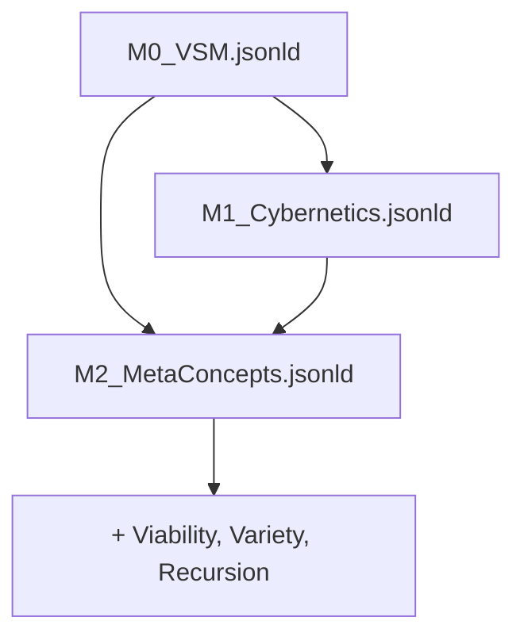

# M0_VSM Prerequisites Analysis
## Viable System Model (Stafford Beer) - M2/M1 Requirements

**Date**: 2026-01-28  
**Author**: Echopraxium with the collaboration of Claude AI  
**Purpose**: Identify M2 metaconcepts and M1 core concepts needed before creating M0_VSM.jsonld

---

## 📋 Executive Summary

The Viable System Model (VSM) by Stafford Beer requires:
- ✅ **14 existing M2 metaconcepts** (ready to use)
- 🆕 **3 new M2 metaconcept candidates** (to validate and add)
- 🔧 **8 M1 core concepts** (either add to M1_CoreConcepts or create M1_Cybernetics extension)

---

## 1️⃣ M2 METACONCEPTS - EXISTING (Ready to Use)

| M2 Metaconcept | VSM Usage | Tensor Formula | VSM Context |
|----------------|-----------|----------------|-------------|
| **m2:System** | Each recursive level of VSM | S⊗F | Every viable system is a system |
| **m2:Environment** | External context (S4 monitors) | F⊗I | Niche within which system operates |
| **m2:Homeostasis** | Dynamic equilibrium via S2-S3 | A⊗S⊗F | Self-regulation maintaining stability |
| **m2:Hierarchy** | S1→S2→S3→S4→S5 structure | S⊗I | Nested levels of control |
| **m2:Network** | Communication channels | S⊗I⊗F | Interconnections between systems |
| **m2:Node** | Each viable subsystem | S⊗I | Elementary network entity |
| **m2:Observer** | Meta-system function | I⊗S | S4 observes environment, S5 observes whole |
| **m2:Regulation** | S2 coordination function | A⊗D⊗I | Anti-oscillation, conflict resolution |
| **m2:Adaptation** | S4 intelligence function | I⊗D | Strategic response to future/external |
| **m2:Emergence** | Viability as emergent property | D⊗S | Whole > sum of parts |
| **m2:Channel** | Communication pathways | F⊗I | Variety transmission |
| **m2:Modularity** | Autonomy of S1 units | S⊗I | Independent operational units |
| **m2:Constraint** | Requisite variety limits | A⊗I | Ashby's Law constraints |
| **m2:Feedback** | Control loops (algedonic signals) | A⊗F⊗I | S3 ↔ S1 resource bargaining |

**Total: 14 M2 metaconcepts** ✅

---

## 2️⃣ M2 METACONCEPTS - NEW CANDIDATES (To Create)

### 🆕 Candidate 1: **Viability**

**Definition**: Capacity of a system to survive and adapt in a changing environment through recursive structural organization.

**Proposed Tensor Formula**: `A⊗S⊗D⊗I`
- **A** (Attractor): System maintains viable equilibrium
- **S** (Structure): Recursive five-system architecture
- **D** (Dynamics): Adaptive response to perturbations
- **I** (Information): Requisite variety management

**Transdisciplinary Validation** (5+ domains required):

| Domain | Example | Viability Indicator |
|--------|---------|---------------------|
| **Biology** | Living organism | Maintains homeostasis, reproduces |
| **Ecology** | Ecosystem | Species diversity, trophic balance |
| **Business** | Company | Profit, market adaptation, growth |
| **Sociology** | Community | Social cohesion, resource sustainability |
| **Engineering** | Technical system | Fault tolerance, graceful degradation |
| **Government** | Political institution | Legitimacy, policy effectiveness |

**Distinction from existing M2**:
- ≠ **Homeostasis** (static equilibrium) → Viability = dynamic survival capacity
- ≠ **Resilience** (bounce back from shock) → Viability = proactive adaptation
- ≠ **Adaptation** (response to change) → Viability = holistic survival architecture

**Polarity**: Neutral (single manifestation)

**Category**: Adaptive

**Perspective**: Dual (Territory: observable viability metrics + Map: viability models)

**Recommendation**: ✅ **STRONG CANDIDATE** - Core VSM concept, highly transdisciplinary

---

### 🆕 Candidate 2: **Variety**

**Definition**: The number of possible distinct states a system or component can exhibit (cybernetic concept from W. Ross Ashby).

**Proposed Tensor Formula**: `S⊗I`
- **S** (Structure): Configuration space
- **I** (Information): Distinguishable states

**Transdisciplinary Validation**:

| Domain | Example | Variety Measure |
|--------|---------|-----------------|
| **Cybernetics** | Control system | Number of control states |
| **Information Theory** | Message source | Shannon entropy |
| **Thermodynamics** | Gas molecules | Microstates (Boltzmann) |
| **Genetics** | DNA sequences | Sequence permutations |
| **Linguistics** | Language | Vocabulary size |
| **Economics** | Market choices | Product diversity |

**Distinction from existing M2**:
- ≠ **Information** (M3 dimension) → Variety = structured enumeration of states
- ≠ **State** (single configuration) → Variety = count of all possible states
- ≠ **Modularity** (decomposition) → Variety = combinatorial explosion

**Polarity**: Neutral

**Category**: Informational

**Perspective**: Territory (measurable quantity)

**Key Principle**: **Ashby's Law of Requisite Variety** - "Only variety can absorb variety"

**Recommendation**: ✅ **STRONG CANDIDATE** - Fundamental cybernetic concept, widely applicable

---

### 🆕 Candidate 3: **Recursion**

**Definition**: Self-similar structural pattern repeated at multiple hierarchical scales, where each level contains complete instances of the pattern.

**Proposed Tensor Formula**: `S⊗S` (structure referencing itself)
- **S₁** (Structure): Pattern template
- **S₂** (Structure): Nested instantiation

**Transdisciplinary Validation**:

| Domain | Example | Recursive Pattern |
|--------|---------|-------------------|
| **VSM** | Viable systems | Each S1 is itself a viable system |
| **Mathematics** | Fractals | Mandelbrot set, Koch snowflake |
| **Computer Science** | Algorithms | Recursive functions, tree traversal |
| **Biology** | Branching structures | Lungs (bronchi), trees (branches) |
| **Linguistics** | Grammar | Nested clauses (Chomsky hierarchy) |
| **Physics** | Renormalization | Scale invariance in phase transitions |

**Distinction from existing M2**:
- ≠ **Hierarchy** (vertical levels) → Recursion = self-similar containment
- ≠ **Modularity** (independent parts) → Recursion = parts are whole-instances
- ≠ **Network** (graph connectivity) → Recursion = nested self-reference

**Polarity**: Neutral

**Category**: Structural

**Perspective**: Territory (observable fractal patterns)

**Recommendation**: ✅ **STRONG CANDIDATE** - Architectural principle of VSM, transdisciplinary

---

## 3️⃣ M1 CORE CONCEPTS - VSM-SPECIFIC

These concepts are **specific to VSM** but could be useful for other cybernetic frameworks:

### Option A: Add to **M1_CoreConcepts.jsonld**
### Option B: Create **M1_Cybernetics.jsonld** (new extension)

**Recommendation**: **Option B** - Create M1_Cybernetics.jsonld for reusability across frameworks

---

### M1 Cybernetics Concepts (8 total)

| M1 Concept | Definition | Instantiates M2 | VSM Usage |
|------------|------------|-----------------|-----------|
| **m1:cyber:RequisiteVariety** | Ashby's Law: control system must have variety ≥ disturbance variety | m2:Constraint, m2:Variety | S2 must match S1 operational variety |
| **m1:cyber:VarietyAttenuation** | Filtering/reducing variety flowing upward | m2:Channel, m2:Variety | S3* audits filter S1 data for S3 |
| **m1:cyber:VarietyAmplification** | Expanding variety flowing downward | m2:Channel, m2:Variety | S3 commands amplified to S1 actions |
| **m1:cyber:MetaSystem** | System managing other systems | m2:Hierarchy, m2:System | S2+S3+S4+S5 collectively |
| **m1:cyber:AlgedonicSignal** | Urgent alert bypassing hierarchy | m2:Signal, m2:Feedback | S1 → S3 emergency escalation |
| **m1:cyber:ResourceBargain** | Negotiation between operations and management | m2:Feedback, m2:Trade-off | S3 ↔ S1 resource allocation |
| **m1:cyber:Autonomy** | Capacity for independent decision-making within constraints | m2:Modularity, m2:Adaptation | S1 units' operational freedom |
| **m1:cyber:Cohesion** | Force maintaining system integrity despite autonomy | m2:Homeostasis, m2:Constraint | S5 creates corporate ethos |

---

## 4️⃣ VSM CORE CONCEPTS (M0 specific entities)

These are **instances/classes in M0_VSM.jsonld** itself:

| VSM Concept | Type | rdfs:subClassOf | Description |
|-------------|------|-----------------|-------------|
| **vsm:ViableSystem** | owl:Class | m2:System | Complete recursive VSM instance |
| **vsm:System1** | owl:Class | m2:Node | Operations (primary activities) |
| **vsm:System2** | owl:Class | m2:Regulation | Coordination (conflict resolution) |
| **vsm:System3** | owl:Class | m2:Homeostasis | Optimization (here & now) |
| **vsm:System4** | owl:Class | m2:Adaptation | Intelligence (there & then) |
| **vsm:System5** | owl:Class | m2:Observer | Policy (identity & ethos) |
| **vsm:OperationalUnit** | owl:Class | vsm:System1 | Individual S1 element (autonomous) |
| **vsm:MetaSystem** | owl:Class | m2:Hierarchy | S2+S3+S4+S5 collective |
| **vsm:EnvironmentNiche** | owl:Class | m2:Environment | External operational context |

---

## 5️⃣ VALIDATION METRICS

### ASFID Scoring (Territory - Eagle Eye)

| Dimension | Score | Justification |
|-----------|-------|---------------|
| **A** Attractor | 0.95 | Clear viable equilibrium states |
| **S** Structure | 0.98 | Extremely formal 5-system architecture |
| **F** Flow | 0.85 | Information/variety flows well-defined |
| **I** Information | 0.98 | Variety as core informational concept |
| **D** Dynamics | 0.88 | Cybernetic feedback loops |
| **ASFID Total** | **0.93** | ✅ Excellent Territory grounding |

### ORIVE Scoring (Map - Sphinx Eye)

| Dimension | Score | Justification |
|-----------|-------|---------------|
| **O** Observability | 0.82 | Diagnostic tools available but complex |
| **R** Reproducibility | 0.95 | Well-documented, 50+ years of applications |
| **I** Interoperability | 0.85 | Compatible with systems theory, cybernetics |
| **V** Verifiability | 0.70 | Qualitative validation, limited quantitative |
| **E** Evolvability | 0.92 | Syntegrity, VSM-PC extensions |
| **ORIVE Total** | **0.85** | ✅ Very good Map quality |

### Epistemic Gap

**δ(M) = |ASFID - ORIVE| = |0.93 - 0.85| = 0.08** ✅ 

**Excellent alignment** (comparable to Fire Triangle: 0.16, Exposure Triangle: 0.25)

---

## 6️⃣ RECOMMENDED ACTION PLAN

### Phase 1: Validate & Add M2 Metaconcepts ⭐ PRIORITY

**Create proposals for M2_MetaConcepts.jsonld**:

```json
{
  "@id": "m2:Viability",
  "rdfs:label": "Viability",
  "m2:hasTensorFormula": "A⊗S⊗D⊗I",
  "m2:hasCategory": "m2:Adaptive",
  "m2:hasPolarity": "neutral",
  "m2:perspective": "dual"
}

{
  "@id": "m2:Variety",
  "rdfs:label": "Variety",
  "m2:hasTensorFormula": "S⊗I",
  "m2:hasCategory": "m2:Informational",
  "m2:hasPolarity": "neutral",
  "m2:perspective": "territory"
}

{
  "@id": "m2:Recursion",
  "rdfs:label": "Recursion",
  "m2:hasTensorFormula": "S⊗S",
  "m2:hasCategory": "m2:Structural",
  "m2:hasPolarity": "neutral",
  "m2:perspective": "territory"
}
```

**Validation required**: 
- Verify transdisciplinary applicability (3+ domains)
- Confirm orthogonality with existing M2
- Expert review by cybernetics community

---

### Phase 2: Create M1_Cybernetics.jsonld

**New M1 extension** for reusable cybernetic concepts:

```
M1_Cybernetics.jsonld
├─ Namespace: m1:cyber:
├─ Category: m3:DomainExtension
├─ 8 core cybernetic concepts
└─ Reusable across VSM, TRIZ, other frameworks
```

---

### Phase 3: Create M0_VSM.jsonld

**VSM as SystemicFramework M0**:

```json
{
  "@id": "m0:vsm:VSM_Framework",
  "@type": "owl:Ontology",
  "m3:ontologyCategory": { "@id": "m3:SystemicFramework" },
  "owl:imports": [
    "M2_MetaConcepts.jsonld",
    "M1_Cybernetics.jsonld"
  ]
}
```

---

## 7️⃣ DEPENDENCIES



**Critical Path**:
1. Add 3 new M2 metaconcepts ← **BLOCKER**
2. Create M1_Cybernetics.jsonld
3. Create M0_VSM.jsonld

---

## 8️⃣ CONCLUSION

**VSM Prerequisites Summary**:
- ✅ 14/17 M2 metaconcepts already exist
- 🆕 3 new M2 candidates identified (Viability, Variety, Recursion)
- 🔧 8 M1 cybernetic concepts to create
- 📊 Excellent ASFID/ORIVE scores (δ=0.08)

**VSM is an ideal SystemicFramework** because:
1. Mature 50-year methodology
2. Strong mathematical foundation (Ashby's variety)
3. Recursive architecture (perfect for TSCG)
4. Extensive validation (Cybersyn, governments, corporations)
5. Will reveal 3 important transdisciplinary M2 metaconcepts

**Next Step**: Validate and formalize the 3 new M2 metaconcepts before proceeding to M0_VSM.jsonld creation.

---

**End of Analysis**
