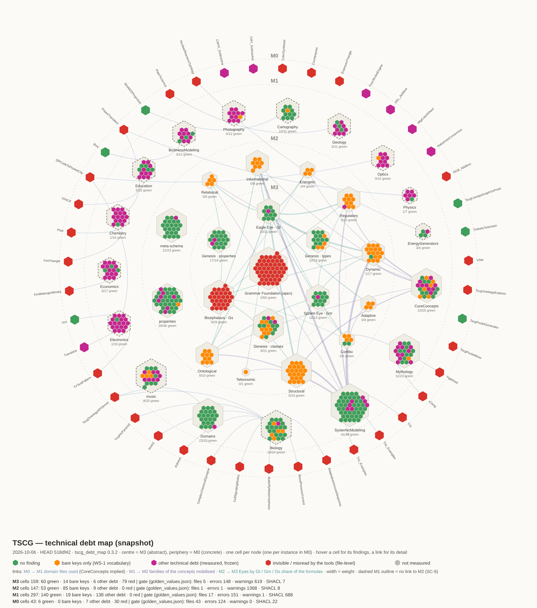

# TSCG — Technical debt overview (master level)

**Author**: Echopraxium with the collaboration of Claude AI
**Version**: 1.0.0
**Date**: 2026-10-06
**Level**: master — above the worksites, next to `worksite.yaml` and the worksite map
(`WS-0/_00_TSCG_Worksite_Map.md`). It routes each debt to the worksite that owns it;
it does not replace the per-worksite notes.

> **Authority.** The frozen counts live in `ontology/toolchain/golden_values.json` and
> are enforced by `ontology/toolchain/run_all_layers.py` (the gate). Numbers quoted
> below are a **dated snapshot** (HEAD `518df42`, 2026-10-06) given for orientation
> only — re-measure before acting (`head-over-memory`). The map is regenerated, never
> drawn by hand.

---

## 1. How the debt is identified

Since 2026-10-06 the four layers are measured by the gate (WS-5 steps 1–4). Each
defect family is a **frozen counter**: it may be non-zero, it may not move by
accident. Up = regression. Down = a deliberate repair (then `--update-golden`, with
the reason in the commit) **or** a check that stopped biting.

Two planes complement each other:

| Plane | Reads | Sees | Instrument |
|---|---|---|---|
| Document | the JSON as written | bare keys, `@vocab`, changelog form, strict expansion | `validator/tscg_validator.py --doc` (D1–D7) |
| Graph | the expanded RDF | what really reaches the triples | SHACL grammars (`--shacl`), cross-file checks (`--ext`), `check_M1`, `check_m0_instances` |

A bare JSON key is dropped on JSON-LD expansion: no SHACL shape and no reasoner can
ever see it. That is why the largest debt (bare keys) stayed invisible to every
graph-level tool, and why it only became measurable with the document plane.

## 2. The map — LayerCake Health

Interactive version (hover a cell or a link): `DebtMap/TSCG_DebtMap_2026-10-06_518df42.svg`.
Regenerate: `python ontology/toolchain/tscg_debt_map.py` (writes a new dated snapshot
into `DebtMap/`; the series of snapshots IS the progress record).

**Reading it.** The Layer Cake seen from above: M3 at the centre (abstract), M0 on
the periphery (concrete). One hexagonal cell per node; one meta-hexagon per cluster
of nodes (M3: the three Eyes on three axes — Eagle/Gt, Sphinx/Gm, Bicephalous/Gs —
with Genesis between them and the apex Grammar Foundation at the heart; M2: one per
family + meta-schema + properties; M1: one per domain; M0: one cell per instance).
Holes are normal.

| Colour | Meaning |
|---|---|
| green | no finding on this node |
| bright orange | bare keys only (D1, WS-1 vocabulary): content dropped on expansion |
| magenta | other technical debt, measured and frozen (SHACL result, header gap, check_M1 / check_m0 failure, changelog vestige…) |
| red | invisible or misread by the tools, because of a FILE-level defect (`@vocab`, named graph, strict-expansion failure, no `owl:Ontology` node) |
| grey | not measured |

Links are drawn only where the data carries a relation: M0 → M1 domain files used
(CoreConcepts implied), M1 → M2 families of the concepts **mobilised**
(`m2:mobilizes`, `comboOf`, `instantiatesGenericConcept` — typing is not usage),
M2 → M3 Eyes weighted by the Gt / Gm / Gs share of the formulas. Clusters are
placed by the barycentre of their inward links. A dashed M1 outline = a domain with
no link to M2.

**What the 2026-10-06 snapshot shows.**
- The **core is red**: the apex Grammar Foundation and Bicephalous carry `@vocab: owl#`,
  so every bare key in them becomes a fake `owl:<key>` term. The worst defect sits
  where everything else rests.
- **M2 is mostly bright orange**: its debt is vocabulary (WS-1), not structure.
- **M1 is magenta-heavy**: SC-6 signatures and the M1 SHACL debt, spread over the
  domains.
- **M0 is mostly red**: 28 instances fail strict JSON-LD expansion, 2 have no
  `owl:Ontology` node.
- **13 M1 domains have no link to M2** (dashed): Biology, BusinessModeling,
  Cartography, Chemistry, Economics, Education, Electronics, EnergyGenerators,
  Geology, Optics, Photography, Physics, music. Their combos still carry monoidal
  formulas (`Fm1m2(Biology, S × I × F)`) instead of naming M2 concepts — SC-6 / DCC006
  made visible. Only CoreConcepts, SystemicModeling and Mythology mobilise M2.
- The thick M2 → M3 links almost all go to Eagle Eye (Gt): the monoidal imbalance
  that WS-3 owns (§4).

## 3. Debt by owner (snapshot 2026-10-06, HEAD `518df42`)

| Layer | Defect | Snapshot | Owner |
|---|---|---|---|
| all | D1 bare keys (occurrences) | M3 619 · M2 1368 · M1 1268 · M0 6604 | **WS-1** (VOC), decision B2 |
| M3 | D2 `@vocab` · G6 fake `owl:` terms | 2 files · 142 | WS-1, after B2 |
| M3 | D5 legacy `metadata.changelog` | 4 | WS-6 (vestiges lot) |
| M3 | G1 no `m3:ontologyType` | 4 | small lot |
| M3 | G2 no label (`FacetValue`, `hasFacetValue`, `valueOf`) | 3 | small lot (text by Michel) |
| M2 | G2 no `rdfs:comment` | 7 | small lot (text by Michel) |
| M2 | G1 no `rdfs:label` · D5 `m2:changeLog` on `m2:Trade-off` | 1 · 1 | small lot · WS-6 |
| M1 | DCC006 monoidal operator in a signature | 127 | **SC-6** |
| M1 | SHACL DomainConceptCombo / ComboFormula | 196 / 138 | M1 SHACL debt · SC-1/SC-6 |
| M1 | DCC010 phantom domains (Music, SystemicModeling, EnergyGenerators, Cascade) | 18 | SC-5 |
| M1 | GCC009, DCC009, DCC008, CTX001, 2 other shapes | 17 | SC-6 / B1 |
| M0 | v1.5 cluster C02/C03/C07/C09 + SHACL RequireM0CommonImport | 22 each | CheckM0 campaign, `migrate_m0_to_v1_5.py` |
| M0 | SHACL CanonicalNamespace · C12 tensor remnants · others | 30 · 24 · 12 | WS-10 · SC-9 · CheckM0 |

The gate's frozen totals per layer are in `golden_values.json` (`files`, `errors`,
`warnings`, `shacl_violations`, `by_code`). Note that M1 `shacl_violations` (688)
counts **lines** of the text report, i.e. 344 violations (§5).

## 4. Modelling debt — WS-3 (Gs monoid review)

Not a gate counter: a **semantic** debt, Michel's authority. The Stereopsis monoid
Gs was introduced after most M2 formulas were written. Measured on HEAD with the
WS-3 definition (nominal Gs primitives T, K, Ss, L): **18 of 97 formulas** use Gs —
unchanged since the WS-3 audit of 2026-07-18. Counting the poles `_^ / _$ / _0` as
well: 40 / 97. (97 = 75 single formulas + 11 nodes carrying two, one per pole.)
Per family, Adaptive, Energetic and Teleonomic are 100 % Territory (Gt); Relational
and Informational are the most mixed.

Proposed instrument: a "monoidal map of M2" (each concept placed by its Gt / Gm / Gs
composition on the three hex axes, coloured by its debt) and a WS-3 gauge in
`worksite.yaml` — the share of formulas using Gs, without a numeric target (a
concept may legitimately stay pure Territory).

## 5. Outside the gate (found, recorded, not frozen)

- **M0 strict expansion**: 28 instances rejected by pyld (18 relative IRIs in
  `@context`, e.g. `M1_extensions/biology/M1_Biology.jsonld#`; 10 CTX-5-style
  colon-named terms) → WS-10.
- **M0 invisible files**: the two copies of `M0_Triz_Examples.jsonld`
  (`systemic-frameworks/Triz/`, `tscg-tools/TscgLittleBigBrain/`) have no
  `owl:Ontology` node: every M0 shape misses them and C15 counts them as passing.
  Also a duplicate.
- **`m2:FeedbackLoop`** formula `m2:Process × m2:Alignment × m2:Homeostasis`: a
  combo of named concepts written with the monoidal operator — what SC-1 forbids;
  SC-8 (FeedbackLoop reclassification).
- **Tooling debt**:
  - `check_M1` counts each SHACL violation twice (lines "Message:" + "Focus Node:");
    fixing it means re-freezing 688 → 344 (a change of unit, to document);
  - `tscg_metrics.py --shacl --shacl-path <M2 grammar>` iterates M1 files only and
    keeps only "(SC-1)" messages: it never measured M2 (the engine now does);
  - `golden_values.json` → `_known_pre_existing_not_counted_here` still quotes July
    figures (502, ~256, ~77): stale;
  - repository-root `CLAUDE.md` is stale (GenesisSpace, tensor formulas…).

## 6. Questions for Michel

1. The 22 M2 classes without `m2:hasFamily` are all meta-schema (`GenericConcept`,
   the 10 family classes, 5 pair classes, 6 contract classes `NaryAttribute`,
   `ConceptContract`, `Triggerable`, `Observable`, `Composable`, `Stateful`).
   Confirm none of them should be a concept with a family.
2. 16 M0 instances link to no M1 domain file (only CoreConcepts or nothing): the
   colour family (CMYK/CMY/RGB/HSL_…, ColorSynthesis, MtgColorWheel),
   Counterpoint, ExposureTriangle, FourStrokeEngine, NakamotoConsensus, VSM, and
   the six tscg-tools instances. Expected (domain not yet modelled) or a gap?
3. WS-3 gauge: adopt "share of M2 formulas using a nominal Gs primitive" as the
   gauge, without target?

## 7. Reduction path (by leverage)

1. **Small safe lots on M3/M2** (~25 points): 5 headers (G1), 5 changelog vestiges
   (D5), 10 labels/comments (G2 — the text is Michel's). Each lowers a counter that
   is re-frozen with a written reason.
2. **Decision B2 (WS-1)** — the largest lever: removing the two `@vocab` turns the
   red core green-or-orange at once (D2 2 and G6 142 drop together) and turns the
   M3 bare keys into terms to declare, which the grammar can then see. Prerequisite
   for a semantic M2 grammar (SC-11b).
3. **M0 v1.5 cluster**: a mechanical migration, tooled by `migrate_m0_to_v1_5.py`
   (likely the same 22 instances across C02/C03/C07/C09/C15 — to verify).
4. **M1 SC-6 and SHACL debt**: formula-by-formula repair, semantic, Michel's call per
   case. The dashed domains on the map are the work list.
5. **Tooling debt**: the `check_M1` double count (documented re-freeze).
6. **WS-3**: Gs remodelling of M2, followed on the monoidal map.

## Changelog

- **1.0.0 (2026-10-06)** — created (decision (c): this master-level document now,
  the worksite-map resync later). Map generated by `tscg_debt_map.py` 0.3.2.
