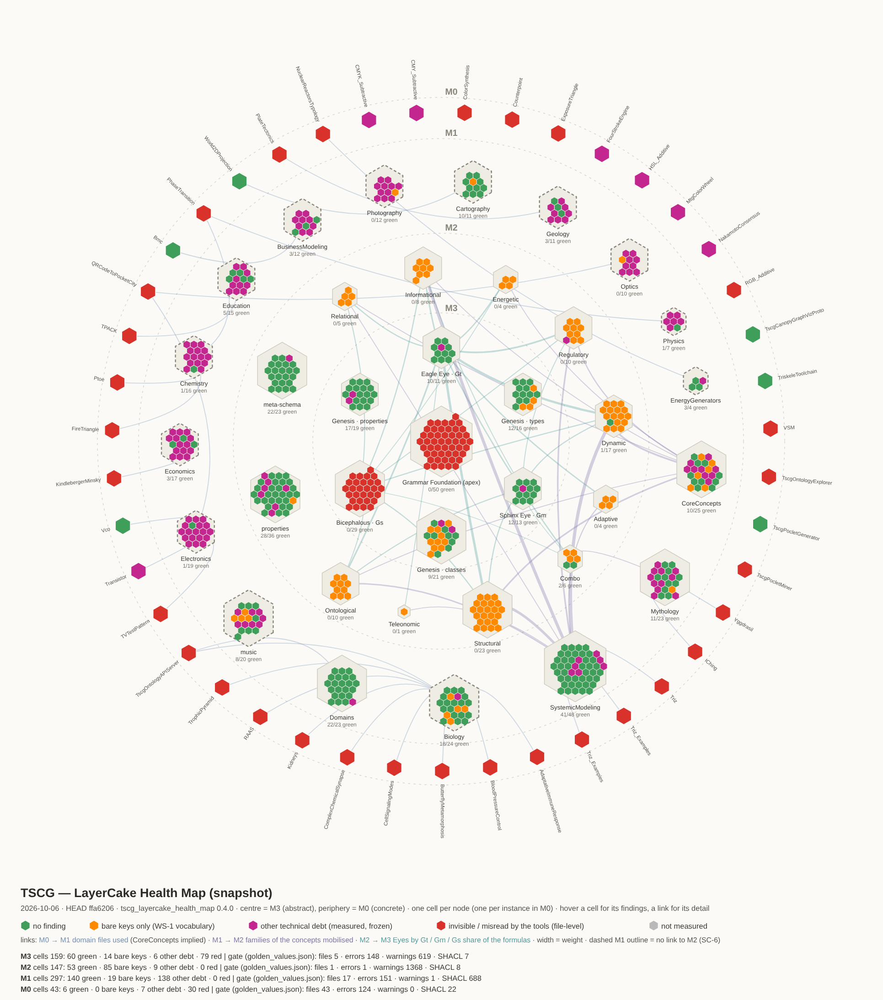

# TSCG — Technical debt overview (master level)

**Author**: Echopraxium with the collaboration of Claude AI
**Version**: 1.4.0
**Date**: 2026-10-10
**Level**: master — above the worksites, next to `worksite.yaml` and the worksite map
(`WS-0/_00_TSCG_Worksite_Map.md`). It routes each debt to the worksite that owns it;
it does not replace the per-worksite notes.

> **Authority.** The frozen counts live in `ontology/toolchain/golden_values.json` and
> are enforced by `ontology/toolchain/run_all_layers.py` (the gate). Numbers quoted
> below are a **dated snapshot** (HEAD `ffa6206`, 2026-10-06) given for orientation
> only — re-measure before acting (`head-over-memory`). The map is regenerated, never
> drawn by hand.

---

## 1. How the debt is identified

Since 2026-10-06 the four layers are measured by the gate (WS-5 steps 1–4). Each
defect family is a **frozen counter**: it may be non-zero, it may not move by
accident. Up = regression. Down = a deliberate repair (then `--update-golden`, with
the reason in the commit) **or** a check that stopped biting.

Two planes complement each other:

| Plane | Reads | Sees | Instrument |
|---|---|---|---|
| Document | the JSON as written | bare keys, `@vocab`, changelog form, strict expansion | `validator/tscg_validator.py --doc` (D1–D7) |
| Graph | the expanded RDF | what really reaches the triples | SHACL grammars (`--shacl`), cross-file checks (`--ext`), `check_M1`, `check_m0_instances` |

A bare JSON key is dropped on JSON-LD expansion: no SHACL shape and no reasoner can
ever see it. That is why the largest debt (bare keys) stayed invisible to every
graph-level tool, and why it only became measurable with the document plane.

## 2. The map — LayerCake Health Map

Interactive version (hover a cell or a link):
`LayerCakeHealthMap/TSCG_LayerCake_Health_Map_2026-10-06_ffa6206.svg`.
Regenerate: `python ontology/toolchain/tscg_layercake_health_map.py` (writes a new dated
snapshot into `LayerCakeHealthMap/`, named after the HEAD it measured; the series of
snapshots IS the progress record). Generate snapshots on a commit that is on `main`.

**Reading it.** The Layer Cake seen from above: M3 at the centre (abstract), M0 on
the periphery (concrete). One hexagonal cell per node; one meta-hexagon per cluster
of nodes (M3: the three Eyes on three axes — Eagle/Gt, Sphinx/Gm, Bicephalous/Gs —
with Genesis between them and the apex Grammar Foundation at the heart; M2: one per
family + meta-schema + properties; M1: one per domain; M0: one cell per instance).
Holes are normal.

| Colour | Meaning |
|---|---|
| green | no finding on this node |
| bright orange | bare keys only (D1, WS-1 vocabulary): content dropped on expansion |
| magenta | other technical debt, measured and frozen (SHACL result, header gap, check_M1 / check_m0 failure, changelog vestige…) |
| red | invisible or misread by the tools, because of a FILE-level defect (`@vocab`, named graph, strict-expansion failure, no `owl:Ontology` node) |
| grey | not measured |

Links are drawn only where the data carries a relation: M0 → M1 domain files used
(CoreConcepts implied), M1 → M2 families of the concepts **mobilised**
(`m2:mobilizes`, `comboOf`, `instantiatesGenericConcept` — typing is not usage),
M2 → M3 Eyes weighted by the Gt / Gm / Gs share of the formulas. Clusters are
placed by the barycentre of their inward links. A dashed M1 outline = a domain with
no link to M2.

**What the 2026-10-06 snapshot shows.**
- The **core is red**: the apex Grammar Foundation and Bicephalous carry `@vocab: owl#`,
  so every bare key in them becomes a fake `owl:<key>` term. The worst defect sits
  where everything else rests.
- **M2 is mostly bright orange**: its debt is vocabulary (WS-1), not structure.
- **M1 is magenta-heavy**: SC-6 signatures and the M1 SHACL debt, spread over the
  domains.
- **M0 is mostly red**: 28 instances fail strict JSON-LD expansion, 2 have no
  `owl:Ontology` node.
- **13 M1 domains have no link to M2** (dashed): Biology, BusinessModeling,
  Cartography, Chemistry, Economics, Education, Electronics, EnergyGenerators,
  Geology, Optics, Photography, Physics, music. Their combos still carry monoidal
  formulas (`Fm1m2(Biology, S × I × F)`) instead of naming M2 concepts — SC-6 / DCC006
  made visible. Only CoreConcepts, SystemicModeling and Mythology mobilise M2.
- The thick M2 → M3 links almost all go to Eagle Eye (Gt): the monoidal imbalance
  that WS-3 owns (§4).

## 3. Debt by owner (snapshot 2026-10-06, HEAD `ffa6206`)

| Layer | Defect | Snapshot | Owner |
|---|---|---|---|
| all | D1 bare keys (occurrences) | M3 619 · M2 1368 · M1 1268 · M0 6604 | **WS-1** (VOC), decision B2 |
| M3 | D2 `@vocab` · G6 fake `owl:` terms | 2 files · 142 | WS-1, after B2 |
| M3 | D5 legacy `metadata.changelog` | 4 | WS-6 (vestiges lot) |
| M3 | G1 no `m3:ontologyType` | 4 | small lot |
| M3 | G2 no label (`FacetValue`, `hasFacetValue`, `valueOf`) | 3 | small lot (text by Michel) |
| M2 | G2 no `rdfs:comment` | 7 | small lot (text by Michel) |
| M2 | G1 no `rdfs:label` · D5 `m2:changeLog` on `m2:Trade-off` | 1 · 1 | small lot · WS-6 |
| M1 | DCC006 monoidal operator in a signature | 127 | **SC-6** |
| M1 | SHACL DomainConceptCombo / ComboFormula | 196 / 138 | M1 SHACL debt · SC-1/SC-6 |
| M1 | DCC010 phantom domains (Music, SystemicModeling, EnergyGenerators, Cascade) | 18 | SC-5 |
| M1 | GCC009, DCC009, DCC008, CTX001, 2 other shapes | 17 | SC-6 / B1 |
| M0 | v1.5 cluster C02/C03/C07/C09 + SHACL RequireM0CommonImport | 22 each | CheckM0 campaign, `migrate_m0_to_v1_5.py` |
| M0 | SHACL CanonicalNamespace · C12 tensor remnants · others | 30 · 24 · 12 | WS-10 · SC-9 · CheckM0 |

The gate's frozen totals per layer are in `golden_values.json` (`files`, `errors`,
`warnings`, `shacl_violations`, `by_code`). Note that M1 `shacl_violations` (688)
counts **lines** of the text report, i.e. 344 violations (§5).

## 4. Modelling debt — WS-3 (Gs monoid review)

Not a gate counter: a **semantic** debt, Michel's authority. The Stereopsis monoid
Gs was introduced after most M2 formulas were written. Measured on HEAD with the
WS-3 definition (nominal Gs primitives T, K, Ss, L): **18 of 97 formulas** use Gs —
unchanged since the WS-3 audit of 2026-07-18. Counting the poles `_^ / _$ / _0` as
well: 40 / 97. (97 = 75 single formulas + 11 nodes carrying two, one per pole.)
Per family, Adaptive, Energetic and Teleonomic are 100 % Territory (Gt); Relational
and Informational are the most mixed.

Proposed instrument: a "monoidal map of M2" (each concept placed by its Gt / Gm / Gs
composition on the three hex axes, coloured by its debt) and a WS-3 gauge in
`worksite.yaml` — the share of formulas using Gs, without a numeric target (a
concept may legitimately stay pure Territory).

## 5. Outside the gate (found, recorded, not frozen)

- **M0 strict expansion**: 28 instances rejected by pyld (18 relative IRIs in
  `@context`, e.g. `M1_extensions/biology/M1_Biology.jsonld#`; 10 CTX-5-style
  colon-named terms) → WS-10.
- **M0 invisible files**: the two copies of `M0_Triz_Examples.jsonld`
  (`systemic-frameworks/Triz/`, `tscg-tools/TscgLittleBigBrain/`) have no
  `owl:Ontology` node: every M0 shape misses them and C15 counts them as passing.
  Also a duplicate.
- **`m2:FeedbackLoop`** formula `m2:Process × m2:Alignment × m2:Homeostasis`: a
  combo of named concepts written with the monoidal operator — what SC-1 forbids;
  SC-8 (FeedbackLoop reclassification).
- **Tooling debt**:
  - *fixed 2026-10-10* — `owl_reasoning_test.py` could not reason on any file with
    `owl:imports` since WS-1 lot 1i made them real IRIs (Owlready2 downloaded raw
    JSON-LD and failed): only the apex, which imports nothing, could be tested. And a
    global inconsistency was reported as "Java not installed". 2.0.0 resolves the
    imports locally (merged graph), separates exit codes (1 inconsistent, 2 input,
    3 environment) and has a negative test on an inconsistent fixture;
  - `check_M1` counts each SHACL violation twice (lines "Message:" + "Focus Node:");
    fixing it means re-freezing 688 → 344 (a change of unit, to document);
  - `tscg_metrics.py --shacl --shacl-path <M2 grammar>` iterates M1 files only and
    keeps only "(SC-1)" messages: it never measured M2 (the engine now does);
  - `golden_values.json` → `_known_pre_existing_not_counted_here` still quotes July
    figures (502, ~256, ~77): stale;
  - repository-root `CLAUDE.md` is stale (GenesisSpace, tensor formulas…).

## 6. Questions for Michel

1. The 22 M2 classes without `m2:hasFamily` are all meta-schema (`GenericConcept`,
   the 10 family classes, 5 pair classes, 6 contract classes `NaryAttribute`,
   `ConceptContract`, `Triggerable`, `Observable`, `Composable`, `Stateful`).
   Confirm none of them should be a concept with a family.
2. 16 M0 instances link to no M1 domain file (only CoreConcepts or nothing): the
   colour family (CMYK/CMY/RGB/HSL_…, ColorSynthesis, MtgColorWheel),
   Counterpoint, ExposureTriangle, FourStrokeEngine, NakamotoConsensus, VSM, and
   the six tscg-tools instances. Expected (domain not yet modelled) or a gap?
3. WS-3 gauge: adopt "share of M2 formulas using a nominal Gs primitive" as the
   gauge, without target?

## 7. Reduction path (by leverage)

1. **Small safe lots on M3/M2** (~25 points): 5 headers (G1), 5 changelog vestiges
   (D5), 10 labels/comments (G2 — the text is Michel's). Each lowers a counter that
   is re-frozen with a written reason.
   *Progress (2026-10-08):* lot (2a) — the 4 M3 D5 vestiges dropped (`1346dae`,
   M3 errors 148 → 141, warnings 619 → 604; the 5th, `m2:changeLog` on
   `m2:Trade-off`, moved to the G2 text lot because it carries a rationale); lot
   (2b-M2) — `rdfs:label` on the M2 header (`00f9b49`, M2 shacl 8 → 7). The 4 M3 G1
   findings need decision **(A)** first (§8.0).
2. **Decision B2 (WS-1)** — the largest lever: removing the two `@vocab` turns the
   red core green-or-orange at once (D2 2 and G6 142 drop together) and turns the
   M3 bare keys into terms to declare, which the grammar can then see. Prerequisite
   for a semantic M2 grammar (SC-11b).
3. **M0 v1.5 cluster**: a mechanical migration, tooled by `migrate_m0_to_v1_5.py`
   (likely the same 22 instances across C02/C03/C07/C09/C15 — to verify).
4. **M1 SC-6 and SHACL debt**: formula-by-formula repair, semantic, Michel's call per
   case. The dashed domains on the map are the work list.
5. **Tooling debt**: the `check_M1` double count (documented re-freeze).
6. **WS-3**: Gs remodelling of M2, followed on the monoidal map.

## 8. Worksites noted 2026-10-08 (Michel) — not yet frozen

Measured on HEAD `00f9b49` (2026-10-08), archives excluded (`*backup*`,
`ontology/Ref/`). Orientation figures from ad-hoc scans, **not gate counters**:
each worksite starts by building its gauge (with a negative test), and only then
freezes a count.

### 8.0 Decision (A) — M3 ontology types (lot (A) done, 2026-10-10)

`m3:ontologyType`, `m3:TscgOntologyTypeScheme` and its 11 concepts are declared in
`M3_GenesisGrammar`, which **imports** the four other M3 files. Giving those four a
`m3:ontologyType` (G1) would make them use a term declared downstream of them — a
level crossing. Decision (Michel, 2026-10-08):

- **(A)** move these declarations up to the apex `M3_GrammarFoundation` (precedent:
  `m3:changelog` is already declared there; IRIs unchanged, the `m3:` namespace stays);
- `M3_GrammarFoundation` → `m3:Genesis`;
- **three perspectives** of Genesis — Territory (`M3_EagleEye`, Gt), Map
  (`M3_SphinxEye`, Gm), Stereopsis (`M3_BicephalousPerspective`, Gs) — all typed
  `m3:GenesisExtension`, whose definition is rewritten accordingly (it still says
  "Genesis Space" and names only the two Eyes);
- `M3_BicephalousPerspective` imports `M3_GrammarFoundation` (today it imports nothing).

### 8.0b The three lenses of the three perspectives (Michel, 2026-10-10)

Found while preparing lot (A): the word **"bicephalous" carries two meanings on HEAD**
— (a) the pair Gt + Gm (`M3_EagleEye` "Bicephalous Grammar = Gt + Gm",
`M3_GenesisGrammar` "bicephalous structural grammar", and the Bootstrap invariant
"Bicephalous basis = ASFID + REVOI"); (b) the Stereopsis grammar Gs
(`M3_BicephalousPerspective`, prefix `m3:bicephalous:`). A founding axiom that was
not explicit. Clarified by Michel:

TSCG has **three perspectives**, each readable through **three lenses** that name the
same thing and complement each other:

| Perspective | Structural-grammar lens | Epistemological lens | Metaphoric lens |
|---|---|---|---|
| 1 | Gt (`×`) | Territory — what a system *is* | **Eagle Eye** — the eye Odin kept, which sees the world |
| 2 | Gm (`+`) | Map — how it is *known* | **Sphinx Eye** — the eye left in Mímir's well, which sees into the source of knowledge |
| 3 | Gs (`\|`) | Stereopsis — the synergy of Territory and Map | **Odin's Wisdom** — what the two eyes produce when they fuse in Odin |
| couplings | Φ : Gt → Gm, Ψ : Gm → Gt | observation, interpretation | **Synesthesia** — one modality evoking the other, never a perfect translation |

**The metaphoric lens — Odin's two eyes.**

- *What the sources say* (Old Norse: *Völuspá*, *Prose Edda* / *Gylfaginning*): Odin
  gives one of his eyes as a pledge to drink from Mímir's well (*Mímisbrunnr*), the
  spring of wisdom; the eye stays hidden in the well. The sources do not name his eyes.
- *The TSCG reading* (an **interpretation**, not part of the myth; to be presented as
  such): Odin holds two eyes on two different planes. The kept eye sees the world as
  it is — the Territory (Eagle Eye). The eye in the well sees into knowledge — the Map
  (Sphinx Eye). Odin is where the two views fuse; **his wisdom**, which neither eye
  has alone, is the Stereopsis — hence the name **Odin's Wisdom** (the product of the
  fusion, not the person).
- *Why it fits*: (1) one head, two eyes, one place of fusion — true stereopsis;
  (2) as in binocular depth, the wisdom feeds on the **disparity** between the two
  eyes: the gap between Territory and Map (epistemic gap δ₁, `M3_GenesisGrammar`) is
  the source of depth, not a defect; (3) the **sacrifice / wisdom polarity** — to
  know, Odin gave up seeing the world with both eyes — echoes Korzybski: the map is
  not the territory, and knowing always costs something of direct seeing.
- *Synesthesia for Φ and Ψ*: Stereopsis fuses two views of the same sense into a new
  dimension (depth); synesthesia makes one modality **evoke** another. That is what
  Φ (Territory evokes a Map: observation) and Ψ (Map evokes a Territory:
  interpretation) do — translations that are never perfect.
- *Names considered and set aside for Gs*: "Synesthesia" (describes Φ/Ψ, not the
  fusion); "RealityMatrix" (film connotation of illusory reality, and "matrix"
  recalls the retired linear-algebra / tensor framing); "Witness" (a witness reports
  without adding, while Gs creates irreducible primitives; "observer" already names
  REVOI's O and Φ; "neutral" is the technical neutral element of each monoid). The
  witness-consciousness (*sakshi*) may join the documentary echoes.
- *Why Odin*: closer to Western culture; Eagle Eye and Sphinx Eye stay, being
  intuitive for a Western audience.
- *Documentary echoes only*, to illustrate the universality of this duality, with
  respect for each culture (symbolic references, not technical terms): **Fuxi and
  Nüwa** (Chinese — two beings whose tails intertwine into one body, often shown
  holding a set square and a compass) and **Ardhanarishvara** (Indian — Shiva and
  Shakti in one body, bound by love: the union *is* the synergy).
- *Superseded reading*: the "bicephalous cyclops" (two heads, one shared body). The
  word **"bicephalous" is retired as a metaphor**; where it survives in names
  (`M3_BicephalousPerspective`, prefix `m3:bicephalous:`), a rename is a separate
  decision (to be weighed with S5-3, which renames prefixes anyway). **Target name
  (Michel, 2026-10-10): `M3_OdinsWisdom.jsonld`**, following the rule that the
  perspective files carry the metaphoric name (`M3_EagleEye`, `M3_SphinxEye`).

**Where it must become explicit** (lot (A) and after):

- `M3_GenesisGrammar` description: M3 is the most abstract layer of the Layer Cake
  M3 → M0 (numbered as in the OMG/UML four-layer metamodel architecture); the three
  perspectives and their three lenses;
- `m3:metaphoricLabel` values: Eagle Eye (`M3_EagleEye`), Sphinx Eye (`M3_SphinxEye`),
  Odin's Wisdom (`M3_BicephalousPerspective`, later `M3_OdinsWisdom`); its `rdfs:comment` points to the metaphoric
  lens and states that it is an interpretation;
- the texts of `m3:GenesisExtension` (three perspectives);
- the Bootstrap invariant "Bicephalous basis" → "three perspectives, three lenses";
- the full explanation (sources, interpretation, echoes) in a rationale `.md` next to
  the M3 ontologies, with a 2–3 sentence version in the `M3_GenesisGrammar` comment.

Also noted for lot (A): `m3:expectedCount` is read by no tool (only the dead
`Ref/M3_GenesisSpace_Ref.ttl`) and duplicates the "Exactly N… Closed set" scope notes
— proposed for removal; the `M3_GenesisGrammar` description is stale ("complete
orthogonal basis… two complementary perspectives", no Gs); `M3_SphinxEye` still lists
`{R,E,V,O,I}` (bare I → S5-1).

### 8.0c Lot (A) as shipped, and the lots it spawned (Michel, 2026-10-10)

Lot (A) delivered decision (A) plus the texts of §8.0b: `m3:ontologyType`, the
scheme and its 11 concepts declared in the apex (split, option c); the five M3 files
typed (GrammarFoundation and GenesisGrammar `m3:Genesis`, the three perspectives
`m3:GenesisExtension`); `m3:metaphoricLabel` (Eagle Eye, Sphinx Eye, Odin's Wisdom);
the `M3_GenesisGrammar` header rewritten (Layer Cake, three lenses); G1b reads the
scheme from the apex (`ext.py` 0.2.0). Gate: M3 G1 4 → 0, shacl_violations 7 → 3.
Found and fixed on the way:

- **"Lambek calculus" was imprecise**: Lambek's 1958 calculus is non-commutative; the
  three TSCG operators are commutative on the types of their monoid, primitive or
  derived → "**commutative Lambek calculus**" in every M3 mention. Precedence
  unchanged and confirmed: **× (Gt) > + (Gm) > | (Gs)**.
- **Gs commutativity contradiction**: `M3_BicephalousPerspective` declared Gs
  `free_monoidal` while `M3_GrammarFoundation` says "All three are associative and
  commutative" → Gs is `free_commutative_monoidal`.
- `m3:expectedCount` removed from all 11 concepts (read by no tool).
- `M3_SphinxEye` `{R,E,V,O,I}` → `{R,E,V,O,Im}` (2 texts; first S5-1 repair).

**Next lots decided** (Michel, 2026-10-10):

1. **Rename lot — `M3_BicephalousPerspective.jsonld` → `M3_OdinsWisdom.jsonld`**,
   with the prefix `m3:bicephalous:` (IRIs, imports, cross-file references, SHACL,
   checkers, Compendium) and the ~15 remaining "bicephalous" texts in M3 prose
   (e.g. `M3_EagleEye` "TSCG Bicephalous Grammar = Gt + Gm", `M3_GenesisGrammar`
   "Bicephalous Coupling"). To be planned together with S5-3, which renames prefixes.
2. **"One role, one property" lot** — `dcterms:description`, `skos:definition` and
   `rdfs:comment` are cumulated on the same nodes (header of `M3_GenesisGrammar`:
   description + comment; SKOS concepts: definition + comment, the latter forced by
   G2, which accepts `skos:prefLabel` for a label but not `skos:definition` for a
   comment). Proposed convention: an ontology file → `dcterms:description` only; a
   SKOS concept → `skos:definition` (meaning) + `skos:scopeNote` (usage), with G2
   accepting `skos:definition`; an OWL term → `rdfs:comment`. Touches the grammar
   (G2) and M3/M2.
   Already applied in lot (A) where no grammar change is needed: the header of
   `M3_GenesisGrammar` (`dcterms:description` only). Known cases for the lot:
   `m3:Genesis` (its `rdfs:comment` repeats the `skos:scopeNote`) and
   `m3:GenesisExtension` (its `rdfs:comment` repeats the `skos:definition`) — kept
   for now because G2 requires an `rdfs:comment` on every TSCG class.

### 8.1 S5-1 — primitives always suffixed

Rule: the ambiguous letters are always qualified by their monoid —
Gt **A St F It D**, Gm **R E V O Im**, Gs **T K Ss L** (plus the poles `_^ _$`).
No bare `S` or `I` anywhere: formulas, alphabet listings, prose.

- Related: **SC-2** "monoid-qualification of atoms" is marked *done* in
  `worksite.yaml` (gauge NOT-1 = 0, `check_M1`). Yet a scan finds **216** bare
  `S`/`I` tokens in formula-valued keys, in **23** files (ontology 128, instances 88)
  — e.g. `M1_CoreConcepts` `S × I × A`, `M1_Electronics` `S × It × D × F` — and the
  M2 header itself still lists `{A,S,F,I,D}` and `{T}`. **NOT-1 does not bite on
  every formula key**: a check that stopped biting, to investigate first.
- Some hits are not primitives (variables `S₁…Sₙ`, colour formulas): the gauge
  must tell them apart.
- Owner: SC-2 reopened (or a new SC id), M1/M0 repair after the gauge.

### 8.2 S5-2 — `m1` only, no `m1core`

- In canonical M1 the `@context` side is done (CTX-4/CTX-5, 2026-10-03).
- Still **109** occurrences in **15** files: 11 M0 poclets (ColorSynthesis,
  Counterpoint, ExposureTriangle, FireTriangle, FourStrokeEngine, KindlebergerMinsky,
  MtgColorWheel, NakamotoConsensus, PlateTectonics, Transistor, TrophicPyramid),
  `M0_Common`, `M2_GenericConcepts`, `M1_Economics`, and
  `docs/M1_CoreConcepts_NuclearUpdate.jsonld`. Top term `m1core:Accretion`
  (dangling, already parked → B1).
- Owner: WS-10 (M0 namespaces) / CheckM0 campaign; M1/M2 hits in a small lot.

### 8.3 S5-3 — no double-colon names

Target form (Michel, 2026-10-08): **`m3:eagle_eye.EagleEye`** — the prefix keeps its
colon (JSON-LD CURIE), the rest is dot-separated.

- **2 399** occurrences in **42** files (ontology 2 187, instances 212). Largest
  families: `m1:extension:…`, `m3:eagle_eye:…`, `m0:yggdrasil:…`,
  `m3:sphinx_eye:…`, `m3:category_theory:…`, `m1:domain:…`,
  `m3:grammar_foundation:…`.
- Not covered by CTX-5 (which removed colon-named `@context` terms, not identifiers).
- The largest of the three, and it renames IRIs: it touches every cross-file
  reference, the SHACL grammars, the checkers and the Compendium. Plan per family,
  with the gate and G1b/G5 as the safety net.
- Owner: new worksite (proposed WS-1 follow-up, naming consistency).

## Changelog

- **1.4.0 (2026-10-10)** — §5 tooling debt: `owl_reasoning_test.py` 2.0.0 (imports
  resolved locally; inconsistency no longer disguised as a Java error).
- **1.3.0 (2026-10-10)** — §8.0c: lot (A) as shipped (commutative Lambek calculus, Gs
  commutativity contradiction fixed, `expectedCount` removed, first S5-1 repair) and
  the two lots it spawned: rename to `M3_OdinsWisdom`, "one role, one property".
- **1.2.0 (2026-10-10)** — §8.0b: the three perspectives and their three lenses
  (structural, epistemological, metaphoric). Metaphoric lens: Odin's two eyes (Eagle
  Eye = Territory, Sphinx Eye in Mímir's well = Map), Odin's Wisdom = the product of
  the fusion (Stereopsis; target file `M3_OdinsWisdom`), Synesthesia = Φ / Ψ,
  sacrifice / wisdom polarity; Chinese and Indian documentary echoes;
  "bicephalous" retired as a metaphor (double meaning found on HEAD).
- **1.1.0 (2026-10-08)** — §8 added: decision (A) on M3 ontology types and three new
  worksites noted by Michel (S5-1 suffixed primitives, S5-2 `m1core` → `m1`, S5-3
  double-colon names → `prefix:a.B`); §7.1 progress (lots 2a and 2b-M2).
- **1.0.1 (2026-10-06)** — map renamed "LayerCake Health Map" (Michel):
  `tscg_layercake_health_map.py`, snapshots in `LayerCakeHealthMap/`. The first snapshot
  carried `518df42`, a local commit that never reached `main` (the pushed equivalent
  has another SHA): replaced by a snapshot of `ffa6206`, same counts.
- **1.0.0 (2026-10-06)** — created (decision (c): this master-level document now,
  the worksite-map resync later). Map generated by `tscg_debt_map.py` 0.3.2.
